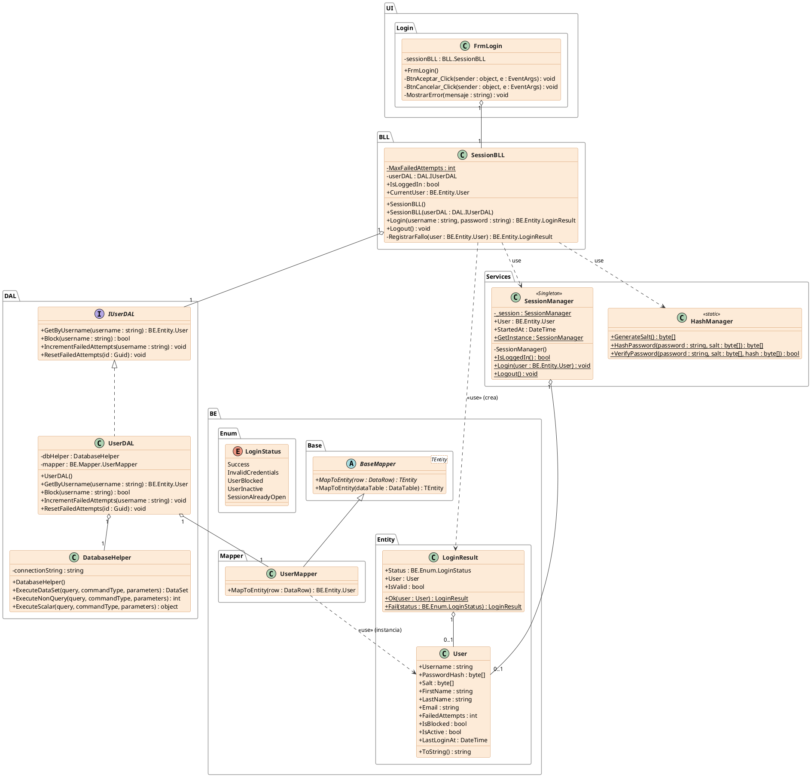

# Diagrama de clases acotado — Módulo Login (v2026-09-02-A01)

Versión recortada, con el mismo alcance que el diagrama original adjunto por
el usuario (solo el módulo de **Login**), actualizada a los nombres y la
arquitectura actuales del código en `ingSoftWinForm`. Para el diagrama
completo de las 5 capas ver
[Diagrama de clases v2026-09-02-A01.md](Diagrama%20de%20clases%20v2026-09-02-A01.md).

## Equivalencia con el diagrama original

| Diagrama original (Login) | Equivalente actual |
|---|---|
| `GUI.Form1` | `UI.Login.FrmLogin` |
| `BLL.GestionUsuarios` | `BLL.SessionBLL` |
| `BE.USUARIO` | `BE.Entity.User` |
| `Servicios.SessionManager` | `Services.SessionManager` (mismo Singleton) |
| `Servicios.CryptoManager` | `Services.HashManager` |
| `DAL.Mapper_usuario<USUARIO>` | `BE.Mapper.UserMapper` |
| `DAL.Mapper<T>` | `BE.Base.BaseMapper<TEntity>` |
| *(no existía)* | `DAL.IUserDAL` / `DAL.UserDAL` / `DAL.DatabaseHelper` (hoy la BLL ya no habla directo con el mapper, pasa por una interfaz de repositorio) y `BE.Entity.LoginResult` (el método `Login` ahora devuelve un resultado tipado en vez de `void`) |

## Diagrama

## Notas de lectura

- Mismo lenguaje visual que el diagrama completo: rombo + "1" = agregación
  (campo propio), triángulo hueco continuo = herencia, triángulo hueco
  punteado = realización de interfaz, flecha punteada «use» = dependencia sin
  campo propio.
- Se dejaron afuera, a propósito, `BLL.BitacoraBLL`, `BE.Entity.Bitacora`,
  `Services.BitacoraManager` y las pantallas `FrmMain`/`FrmProfile`/`FrmEvent`
  — no participan del caso de uso Login. Están documentadas en el diagrama
  completo.
- A diferencia del diagrama original, hoy `BLL.SessionBLL` no habla
  directamente con el mapper: pasa por `DAL.IUserDAL` (inyectable, ver los
  dos constructores), y es `DAL.UserDAL` quien internamente usa
  `DatabaseHelper` + `BE.Mapper.UserMapper`. Es la diferencia arquitectónica
  más relevante entre la versión vieja del proyecto y la actual.
