# Diagrama de clases — ingSoftWinForm (v2026-09-02-A01)

Diagrama de clases UML completo del proyecto `ingSoftWinForm` (las 5 capas), en
notación **PlantUML** (pegar el bloque entre ` @startuml`/`@enduml` en
[plantuml.com](https://www.plantuml.com/plantuml/uml/) o renderizarlo con el
plugin de PlantUML de tu editor).

Reemplaza y amplía al diagrama de Login original (`GUI.Form1` /
`BE.USUARIO` / `BLL.GestionUsuarios` / `Servicios.*` / `DAL.Mapper*`): el
código creció a los namespaces `UI` / `Services` / `BLL` / `BE` / `DAL` y
sumó el módulo de Bitácora (auditoría de eventos), una jerarquía de
entidades base y las interfaces del DAL.

## Equivalencia con el diagrama original

| Diagrama original (Login) | Equivalente actual |
|---|---|
| `GUI.Form1` | `UI.Login.FrmLogin` (+ `FrmMain`, `FrmLogout`, `FrmProfile`, `FrmEvent`, nuevos) |
| `Servicios.SessionManager` | `Services.SessionManager` (mismo Singleton) |
| `Servicios.CryptoManager` | `Services.HashManager` |
| `BE.USUARIO` | `BE.Entity.User` |
| `BLL.GestionUsuarios` | `BLL.SessionBLL` (+ `BLL.BitacoraBLL`, nuevo) |
| `DAL.Mapper_usuario<USUARIO>` | `BE.Mapper.UserMapper` (se movió de `DAL` a `BE`) |
| `DAL.Mapper<T>` | `BE.Base.BaseMapper<TEntity>` (se movió de `DAL` a `BE`) |
| *(no existía)* | `BE.Entity.Bitacora`, `BE.Entity.LoginResult`, `BE.Enum.*`, `BE.Base.BaseAuditEntity/BaseEntity/BaseGuidEntity`, `BE.Mapper.BitacoraMapper`, `BLL.BitacoraBLL`, `DAL.IUserDAL/IBitacoraDAL/UserDAL/BitacoraDAL/DatabaseHelper`, `Services.BitacoraManager`, `UI.FrmMain/FrmLogout/FrmProfile/FrmEvent` |

## Diagrama

```plantuml
@startuml DiagramaDeClases_ingSoftWinForm

skinparam classAttributeIconSize 0
skinparam classFontStyle bold
skinparam shadowing false
skinparam roundcorner 6
skinparam class {
    BackgroundColor #FDEBD8
    BorderColor #C87F41
    ArrowColor #333333
    FontColor #222222
}
skinparam package {
    BackgroundColor #FFFFFF
    BorderColor #999999
}
skinparam note {
    BackgroundColor #FFFFF0
    BorderColor #C8A030
}

' ============================= UI (Presentation) =============================
namespace UI {
    class Program <<static>> {
        - {static} Main() : void
    }

    class FrmMain {
        - sessionBLL : SessionBLL
        + FrmMain()
        - FrmMain_Load(sender : object, e : EventArgs) : void
        + AbrirHijo<TForm>() : void
        - MostrarUsuarioEnSesion() : void
        - MnuPerfil_Click(sender : object, e : EventArgs) : void
        - MnuEvent_Click(sender : object, e : EventArgs) : void
        - MnuCerrarSesion_Click(sender : object, e : EventArgs) : void
        - MnuSalir_Click(sender : object, e : EventArgs) : void
        - MnuCascada_Click(sender : object, e : EventArgs) : void
        - MnuMosaicoHorizontal_Click(sender : object, e : EventArgs) : void
        - MnuMosaicoVertical_Click(sender : object, e : EventArgs) : void
        - MnuCerrarTodas_Click(sender : object, e : EventArgs) : void
    }

    namespace Login {
        class FrmLogin {
            - sessionBLL : BLL.SessionBLL
            + FrmLogin()
            - BtnAceptar_Click(sender : object, e : EventArgs) : void
            - BtnCancelar_Click(sender : object, e : EventArgs) : void
            - MostrarError(mensaje : string) : void
        }

        class FrmLogout {
            - sessionBLL : BLL.SessionBLL
            + FrmLogout()
            - BtnCancelar_Click(sender : object, e : EventArgs) : void
            - BtnAceptar_Click(sender : object, e : EventArgs) : void
        }
    }

    namespace Profile {
        class FrmProfile {
            - sessionBLL : BLL.SessionBLL
            + FrmProfile()
            - MostrarDatos(user : BE.Entity.User) : void
            - {static} DescribirEstado(user : BE.Entity.User) : string
            - {static} FormatearFecha(fecha : DateTime) : string
            - BtnCerrar_Click(sender : object, e : EventArgs) : void
        }
    }

    namespace Event {
        class FrmEvent {
            - {static} Todos : string
            - {static} DiasPorDefecto : int
            - bitacoraBLL : BLL.BitacoraBLL
            + FrmEvent()
            - BtnFiltrar_Click(sender : object, e : EventArgs) : void
            - BtnLimpiar_Click(sender : object, e : EventArgs) : void
            - ResetearFiltros() : void
            - {static} CargarCombo<TEnum>(combo : ComboBox) : void
            - {static} Seleccion<TEnum>(combo : ComboBox) : TEnum
            - Cargar(consulta : Func<List<BE.Entity.Bitacora>>) : void
            - {static} Proyectar(bitacora : BE.Entity.Bitacora) : Fila
        }

        class Fila {
            + Id : int
            + Fecha : string
            + Tipo : string
            + Evento : string
            + Prioridad : string
            + Usuario : string
            + Email : string
            + Detalle : string
        }

        FrmEvent *-- Fila : nested (private)
    }
}

' ============================= Services =============================
namespace Services {
    class SessionManager <<Singleton>> {
        - {static} _session : SessionManager
        + User : BE.Entity.User
        + StartedAt : DateTime
        - SessionManager()
        + {static} GetInstance : SessionManager
        + {static} IsLoggedIn() : bool
        + {static} Login(user : BE.Entity.User) : void
        + {static} Logout() : void
    }

    class HashManager <<static>> {
        - {static} SaltSize : int
        - {static} HashSize : int
        - {static} Iterations : int
        + {static} GenerateSalt() : byte[]
        + {static} HashPassword(password : string, salt : byte[]) : byte[]
        + {static} VerifyPassword(password : string, salt : byte[], hash : byte[]) : bool
    }

    class BitacoraManager <<static>> {
        - {static} MaxDetailLength : int
        + {static} EventoBitacora(evento, detalle, prioridad, user) : BE.Entity.Bitacora
        + {static} ErrorBitacora(evento, detalle, prioridad, user) : BE.Entity.Bitacora
        - {static} Crear(tipo, evento, detalle, prioridad, user) : BE.Entity.Bitacora
        - {static} Recortar(detail : string) : string
        - {static} UsuarioDeSesion() : BE.Entity.User
        - {static} AplanarRolesPermisos(user : BE.Entity.User) : string
    }
}

' ============================= BLL =============================
namespace BLL {
    class SessionBLL {
        - {static} MaxFailedAttempts : int
        - userDAL : DAL.IUserDAL
        - bitacoraBLL : BitacoraBLL
        + IsLoggedIn : bool
        + CurrentUser : BE.Entity.User
        + SessionBLL()
        + SessionBLL(userDAL : DAL.IUserDAL)
        + SessionBLL(userDAL : DAL.IUserDAL, bitacoraBLL : BitacoraBLL)
        + Login(username : string, password : string) : BE.Entity.LoginResult
        + Logout() : void
        - RegistrarFallo(user : BE.Entity.User) : BE.Entity.LoginResult
    }

    class BitacoraBLL {
        - bitacoraDAL : DAL.IBitacoraDAL
        + BitacoraBLL()
        + BitacoraBLL(bitacoraDAL : DAL.IBitacoraDAL)
        + Registrar(bitacora : BE.Entity.Bitacora) : void
        + RegistrarEvento(evento, detalle, prioridad, user = null) : void
        + RegistrarError(evento, detalle, prioridad, user = null) : void
        + GetAll() : List<BE.Entity.Bitacora>
        + GetByFilter(from, to, tipo, evento, prioridad) : List<BE.Entity.Bitacora>
    }
}

' ============================= BE.Base =============================
namespace BE.Base {
    abstract class BaseAuditEntity {
        + CreatedAt : DateTime
        + CreatedBy : string
        + UpdatedAt : DateTime
        + UpdatedBy : string
    }

    abstract class BaseEntity {
        + Id : int
    }

    abstract class BaseGuidEntity {
        + Id : Guid
        + BaseGuidEntity()
    }

    abstract class "BaseMapper<TEntity>" as BaseMapper {
        + {abstract} MapToEntity(row : DataRow) : TEntity
        + MapAll(dataTable : DataTable) : IEnumerable<TEntity>
        + MapToEntity(dataTable : DataTable) : TEntity
    }

    BaseAuditEntity <|-- BaseEntity
    BaseAuditEntity <|-- BaseGuidEntity
}

' ============================= BE.Entity =============================
namespace BE.Entity {
    class User {
        + Username : string
        + PasswordHash : byte[]
        + Salt : byte[]
        + FirstName : string
        + LastName : string
        + Email : string
        + FailedAttempts : int
        + IsBlocked : bool
        + IsActive : bool
        + LastLoginAt : DateTime
        + ToString() : string
        .. heredado de BaseGuidEntity ..
        + Id : Guid
    }

    class Bitacora {
        + id_bitacora : int
        + Type : BE.Enum.BitacoraType
        + NameEvent : BE.Enum.NameEvent
        + Priority : BE.Enum.Priority
        + Detail : string
        + BitacoraDate : DateTime
        + IdUser : string
        + Email : string
        + FirstName : string
        + LastName : string
        + RolesPermisos : string
        + ToString() : string
    }

    class LoginResult {
        + Status : BE.Enum.LoginStatus
        + User : User
        + IsValid : bool
        + {static} Ok(user : User) : LoginResult
        + {static} Fail(status : BE.Enum.LoginStatus) : LoginResult
    }

    LoginResult "1" o-- "0..1" User
}

' ============================= BE.Enum =============================
namespace BE.Enum {
    enum BitacoraType {
        Event
        Error
    }

    enum LoginStatus {
        Success
        InvalidCredentials
        UserBlocked
        UserInactive
        SessionAlreadyOpen
    }

    enum NameEvent {
        Login = 1
        Logout = 2
        CrearUsuario = 3
        ModificarUsuario = 4
        EliminarUsuario = 5
        CambiarPassword = 6
        AccesoNoAutorizado = 7
        ErrorSistema = 8
    }

    enum Priority {
        Low
        Medium
        High
        Critical
        Fatal
    }
}

' ============================= BE.Mapper =============================
namespace BE.Mapper {
    class UserMapper {
        + MapToEntity(row : DataRow) : BE.Entity.User
    }

    class BitacoraMapper {
        + MapToEntity(row : DataRow) : BE.Entity.Bitacora
    }

    BE.Base.BaseMapper <|-- UserMapper
    BE.Base.BaseMapper <|-- BitacoraMapper
}

' ============================= DAL =============================
namespace DAL {
    interface IUserDAL {
        + GetByUsername(username : string) : BE.Entity.User
        + GetAll() : List<BE.Entity.User>
        + Block(username : string) : bool
        + IncrementFailedAttempts(username : string) : void
        + ResetFailedAttempts(id : Guid) : void
    }

    interface IBitacoraDAL {
        + Insert(bitacora : BE.Entity.Bitacora) : int
        + GetAll() : List<BE.Entity.Bitacora>
        + GetByFilter(from, to, tipo, evento, prioridad) : List<BE.Entity.Bitacora>
    }

    class DatabaseHelper {
        - connectionString : string
        + DatabaseHelper()
        + ExecuteDataSet(query, commandType, parameters) : DataSet
        + ExecuteNonQuery(query, commandType, parameters) : int
        + ExecuteScalar(query, commandType, parameters) : object
    }

    class UserDAL {
        - dbHelper : DatabaseHelper
        - mapper : BE.Mapper.UserMapper
        + UserDAL()
        + GetByUsername(username : string) : BE.Entity.User
        + GetAll() : List<BE.Entity.User>
        + Block(username : string) : bool
        + IncrementFailedAttempts(username : string) : void
        + ResetFailedAttempts(id : Guid) : void
    }

    class BitacoraDAL {
        - dbHelper : DatabaseHelper
        - mapper : BE.Mapper.BitacoraMapper
        + BitacoraDAL()
        + Insert(bitacora : BE.Entity.Bitacora) : int
        + GetAll() : List<BE.Entity.Bitacora>
        + GetByFilter(from, to, tipo, evento, prioridad) : List<BE.Entity.Bitacora>
        - {static} Opcional<TEnum>(nombre : string, valor : TEnum) : SqlParameter
    }

    IUserDAL <|.. UserDAL
    IBitacoraDAL <|.. BitacoraDAL
    UserDAL "1" o-- "1" DatabaseHelper
    BitacoraDAL "1" o-- "1" DatabaseHelper
}

' ===================== Herencia entre capas =====================
BE.Base.BaseGuidEntity <|-- BE.Entity.User

' ===================== Composición / agregación (has-a, "1") =====================
UI.Login.FrmLogin   "1" o-- "1" BLL.SessionBLL
UI.Login.FrmLogout  "1" o-- "1" BLL.SessionBLL
UI.Profile.FrmProfile "1" o-- "1" BLL.SessionBLL
UI.FrmMain          "1" o-- "1" BLL.SessionBLL
UI.Event.FrmEvent   "1" o-- "1" BLL.BitacoraBLL

BLL.SessionBLL   "1" o-- "1" DAL.IUserDAL
BLL.SessionBLL   "1" o-- "1" BLL.BitacoraBLL
BLL.BitacoraBLL  "1" o-- "1" DAL.IBitacoraDAL

DAL.UserDAL      "1" o-- "1" BE.Mapper.UserMapper
DAL.BitacoraDAL  "1" o-- "1" BE.Mapper.BitacoraMapper

Services.SessionManager "1" o-- "0..1" BE.Entity.User

' ===================== Dependencias / uso («use», punteada) =====================
UI.Program           ..> UI.Login.FrmLogin : «use»
UI.Program           ..> UI.FrmMain        : «use»
UI.FrmMain           ..> UI.Profile.FrmProfile : «use»
UI.FrmMain           ..> UI.Event.FrmEvent      : «use»
UI.FrmMain           ..> UI.Login.FrmLogout     : «use»
UI.Login.FrmLogin    ..> BE.Entity.LoginResult  : «use»

BLL.SessionBLL       ..> Services.HashManager    : «use»
BLL.SessionBLL       ..> Services.SessionManager : «use»
BLL.BitacoraBLL      ..> Services.BitacoraManager : «use»

BE.Mapper.UserMapper     ..> BE.Entity.User     : «use» (instancia)
BE.Mapper.BitacoraMapper ..> BE.Entity.Bitacora : «use» (instancia)

Services.BitacoraManager ..> Services.SessionManager : «use»

@enduml
```

## Notas de lectura

- **Rombo + "1"** (`o--`): agregación — la clase del lado del rombo mantiene una
  referencia (campo `readonly`) a la otra, igual que en el diagrama original
  (`Form1 (1) — GestionUsuarios`, `GestionUsuarios (1) — Mapper_usuario`).
- **Triángulo hueco continuo** (`<|--`): herencia de clase (`BaseGuidEntity <|-- User`,
  `BaseMapper<TEntity> <|-- UserMapper`).
- **Triángulo hueco punteado** (`<|..`): implementación de interfaz
  (`IUserDAL <|.. UserDAL`, `IBitacoraDAL <|.. BitacoraDAL`).
- **Flecha punteada `«use»`** (`..>`): dependencia sin campo propio — llamadas a
  miembros `static` de un servicio/singleton, o construcción puntual de un
  objeto de otra clase.
- Los `+`/`-`/`#` delante de cada miembro son la visibilidad (`public` /
  `private` / `protected`), y `{static}` marca miembros estáticos, igual que
  el candado gris/verde/rojo de Enterprise Architect en el PNG original.
- Las propiedades autoimplementadas de C# (`{ get; set; }`) se listan como
  atributos tipados (`+ Nombre : Tipo`) en vez de separarlas en accessors
  `get_X`/`set_X`, para que el diagrama sea legible sin perder visibilidad ni
  tipo.
