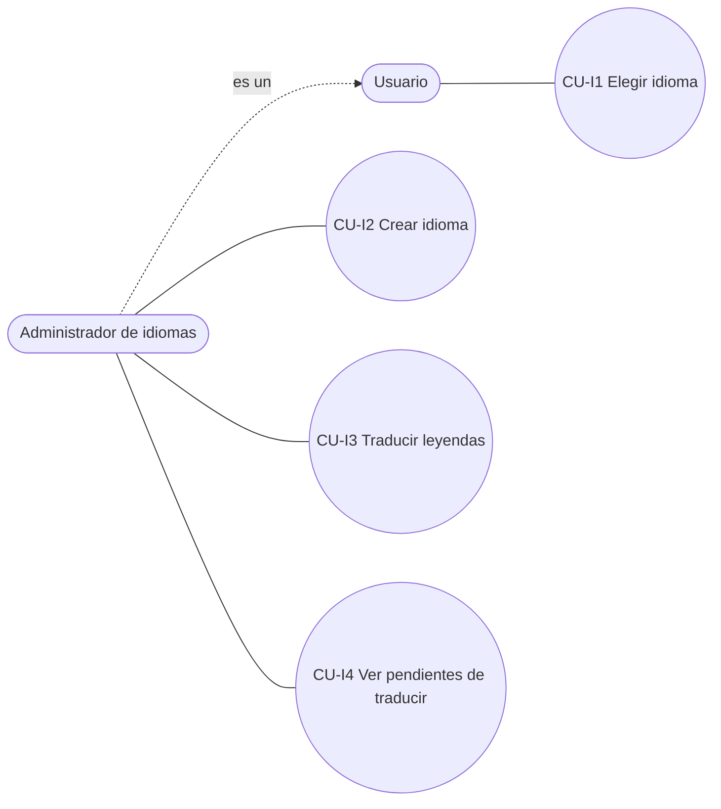

# CU - Gestión de múltiples idiomas (T05)

## Objetivo

Que toda leyenda y título que se lee en la interfaz pueda mostrarse en el idioma que elija el usuario,
con **cambio dinámico** (sin reiniciar ni reabrir ventanas) y con la posibilidad de **incorporar idiomas
nuevos desde el sistema**, sin hojas de recursos estáticas (`.resx`): los textos viven en la base de datos.

## Actores

| Actor | Descripción |
|---|---|
| Usuario (cualquier rol) | Elige su idioma. Antes de iniciar sesión lo hace en la pantalla de login. |
| Administrador de idiomas | Usuario con el permiso `GESTIONAR_IDIOMAS` (rol `administrador`): crea idiomas y carga traducciones. |

## CU-I1 Elegir idioma

**Precondición:** hay al menos un idioma activo (el idioma por defecto lo está siempre).

**Flujo principal**
1. El usuario abre el menú *Idioma* (o, en el login, el combo *Idioma*) y elige uno.
2. El sistema carga los textos del idioma elegido y del idioma por defecto.
3. Si hay sesión, guarda la elección en el usuario (`[User].IdIdioma`) y la registra en bitácora (`CambiarIdioma`).
4. El sistema notifica a todos los formularios abiertos y cada uno vuelve a mostrar sus textos.

**Flujos alternativos**
- FA-1 El idioma no existe o está inactivo: se informa `msg.idioma.noDisponible` y no cambia nada.
- FA-2 Al iniciar sesión se aplica el idioma guardado del usuario; si nunca eligió uno se conserva el que estaba en uso.
- FA-3 Sin conexión a la base: la UI conserva los textos con los que fue diseñada.

**Regla de negocio — leyenda no traducida:** si el idioma activo no tiene la traducción de una etiqueta, se
muestra el texto del idioma por defecto (español) **marcado como no traducido** (tooltip
«Sin traducir»). La BLL lo informa con `Leyenda.Traducido = false`; cómo se marca es decisión de la UI.

## CU-I2 Crear idioma (`GESTIONAR_IDIOMAS`)

1. El administrador abre *Idioma ▸ Gestión de idiomas*, ingresa código (`pt`, `pt-br`) y nombre, y pulsa *Crear idioma*.
2. El sistema valida (código de 2–3 letras minúsculas con región opcional, nombre obligatorio, código no repetido).
3. Crea el idioma activo y no default; **no** crea traducciones: todas las etiquetas quedan pendientes.
4. Registra `CrearIdioma` en bitácora y avisa a los formularios para que el menú *Idioma* muestre el nuevo idioma.

También se puede cambiar el nombre y activar/desactivar un idioma (el idioma por defecto no se puede desactivar).

## CU-I3 Traducir leyendas (`GESTIONAR_IDIOMAS`)

1. El administrador elige un idioma en la lista; la grilla muestra cada etiqueta con su texto por defecto y su traducción.
2. Edita la columna *Traducción* y confirma la celda: se guarda (`ActualizarTraduccion` en bitácora).
3. Un texto vacío quita la traducción (la etiqueta vuelve a pendiente).
4. Si el idioma editado es el que se está usando, los formularios se refrescan en el acto.

## CU-I4 Ver pendientes de traducir

Con *Solo sin traducir* la grilla filtra las etiquetas que el idioma elegido todavía no tiene; el pie muestra
«N etiqueta(s), M sin traducir».

## Permisos

| Permiso | Otorgado a | Habilita |
|---|---|---|
| (ninguno) | todos | CU-I1 |
| `GESTIONAR_IDIOMAS` | `administrador` | CU-I2, CU-I3, CU-I4 y la opción de menú *Gestión de idiomas* |

La BLL vuelve a validar el permiso en cada operación y registra `AccesoNoAutorizado` si falta (igual que `RoleBLL`).

## Alcance y limitaciones

- Se traducen controles de los formularios, textos que arma el código y mensajes de la BLL (por clave, ver `DC-idiomas-observer.md`).
- No se traducen los **datos**: nombres de roles y permisos, y los valores de los enums de la bitácora (`Login`, `High`...).
- El idioma por defecto es el único respaldo; no hay cadena de respaldo (`pt-br` → `pt` → `es`).
