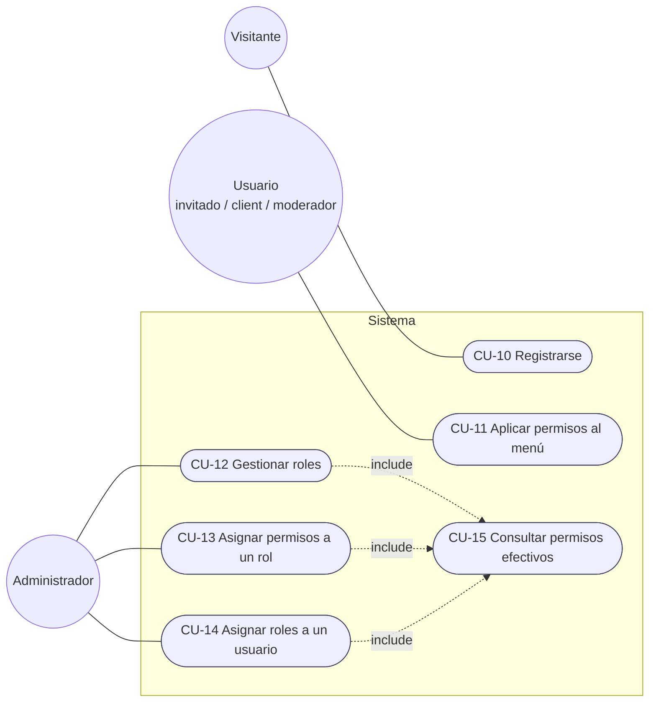

# CU-T04 - Gestión de perfiles de usuario

## Diagrama de casos de uso

## Roles sembrados

| Rol | Qué puede hacer |
|---|---|
| `invitado` | Ver su perfil y cerrar sesión (único rol que recibe el registro abierto) |
| `client` | Lo anterior + ver la página de inicio |
| `moderador` | Lo del client + ver la bitácora |
| `administrador` | Lo del moderador + gestionar roles y asignarlos a usuarios |

## CU-10 - Registrarse

| Campo | Detalle |
|---|---|
| **ID** | CU-10 |
| **Actor principal** | Visitante (cualquiera, sin sesión) |
| **Objetivo** | Crear una cuenta propia con el rol `invitado` |
| **Precondiciones** | Pantalla de login abierta |
| **Postcondiciones** | Usuario creado con contraseña hasheada (PBKDF2 + salt) y rol `invitado`; queda en bitácora (`CrearUsuario`) |

**Flujo principal**
1. El visitante pulsa *Registrarse* en el login.
2. Ingresa usuario, contraseña (dos veces), nombre, apellido y email opcional.
3. El sistema valida los datos y que usuario y email no existan.
4. El sistema genera salt y hash, e inserta el usuario y su rol `invitado` en una única transacción.
5. El sistema registra el alta en bitácora y vuelve al login con el usuario precargado.

**Flujos alternativos**
- **FA-1 Datos inválidos** (usuario < 3 caracteres o con espacios, contraseña < 8, contraseñas distintas, email mal formado, nombre/apellido vacíos): se informa el motivo y no se crea nada.
- **FA-2 Usuario o email ya existente**: se informa y no se crea nada.
- **FA-3 Error de base de datos**: se informa un mensaje genérico, la transacción hace *rollback* y el error queda en bitácora (`ErrorSistema`).

## CU-11 - Aplicar permisos al menú

| Campo | Detalle |
|---|---|
| **ID** | CU-11 |
| **Actor principal** | Usuario con sesión |
| **Objetivo** | Mostrar sólo las opciones permitidas por los roles del usuario |
| **Precondiciones** | Sesión abierta (CU-01) con los roles cargados |

**Flujo principal**: al abrir el menú principal el sistema consulta `HasPermission` por cada opción
(`VER_INICIO` → Inicio, `VER_MI_PERFIL` → Mi perfil, `VER_BITACORA` → Bitácora,
`GESTIONAR_ROLES` → Gestión de roles, `CERRAR_SESION` → Cerrar sesión) y oculta las no permitidas.

**Nota**: ocultar no es seguridad; cada operación sensible vuelve a validar el permiso en la BLL.

## CU-12 / CU-13 / CU-14 - Gestionar roles

| Campo | Detalle |
|---|---|
| **Actor principal** | Administrador |
| **Permisos requeridos** | `GESTIONAR_ROLES` (CU-12, CU-13), `ASIGNAR_ROLES_USUARIO` (CU-14) |
| **Pantalla** | *Gestión de roles* (3 `TreeView`: estructura de roles, permisos efectivos del usuario, catálogo) |
| **Postcondiciones** | El cambio queda persistido y en bitácora |

**Flujo principal (CU-12, crear / eliminar rol)**
1. El administrador abre *Gestión de roles*; el sistema muestra los árboles (función recursiva sobre el Composite).
2. Escribe el nombre del rol y pulsa *Crear Rol*; o selecciona un rol y pulsa *Eliminar Rol*.
3. El sistema valida y aplica la operación, registra el evento y refresca los árboles.

**Flujo principal (CU-13, permisos de un rol)**: selecciona el rol en la estructura y un permiso (simple o
compuesto) del catálogo → *Asignar Permiso a Rol*; o selecciona un permiso asignado directamente → *Quitar Permiso de Rol*.

**Flujo principal (CU-14, roles de un usuario)**: elige un usuario en el combo; selecciona un rol del catálogo →
*Asignar Rol a Usuario*, o un rol en *Permisos efectivos* → *Quitar Rol a Usuario*.

**Flujos alternativos / reglas**
- **FA-1 Sin permiso**: la BLL rechaza la operación y registra `AccesoNoAutorizado`.
- **FA-2 Nombre vacío, > 50 caracteres o duplicado** al crear un rol.
- **FA-3 Eliminar el rol `invitado` o un rol con usuarios asignados**: se rechaza.
- **FA-4 Permiso ya otorgado** (directo o dentro de un compuesto) al agregarlo; o **no asignado directamente** al quitarlo.
- **FA-5 Usuario ya tiene / no tiene el rol** al asignar / quitar.
- **FA-6 Quitarse a uno mismo un rol que otorga `GESTIONAR_ROLES`**: se rechaza.
- **No existe** alta, baja ni modificación de permisos: el catálogo es fijo.

## Requerimientos asociados

| Req | Descripción |
|---|---|
| RF-Permisos-01 | Los permisos se resuelven sobre un árbol de N niveles (patrón Composite) |
| RF-Permisos-02 | Todo usuario registrado por su cuenta recibe el rol `invitado` |
| RF-Permisos-03 | Un usuario puede tener varios roles; sus permisos efectivos son la unión |
| RF-Permisos-04 | El ABM es de roles; los permisos (simples y compuestos) son un catálogo fijo |
| RNF-Seguridad-03 | Toda operación de gestión y todo acceso denegado queda auditado |
| RNF-UI-01 | El árbol de permisos se muestra en un `TreeView` mediante funciones recursivas |

## Diagramas relacionados

- Clases: [DC-permisos-composite.md](../DC%20-%20Diagrama%20de%20clases/DC-permisos-composite.md)
- Datos: [DER-permisos-composite.md](../DER%20-%20Diagrama%20entidad%20relación/DER-permisos-composite.md)
- Secuencia: [DS-permisos-composite.md](../DS%20-%20Diagramas%20de%20secuencia/DS-permisos-composite.md)
- Modelo alternativo: [DC-modelo-I-vs-II-permisos.md](../DC%20-%20Diagrama%20de%20clases/DC-modelo-I-vs-II-permisos.md)
