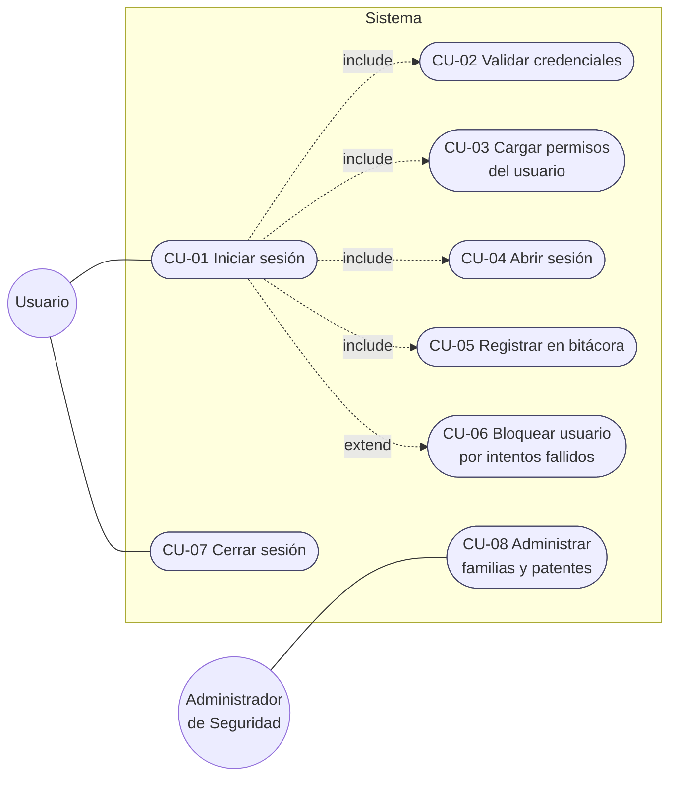

# CU-01 - Iniciar sesión (Login)

## Diagrama de casos de uso

## Narrativa

| Campo | Detalle |
|---|---|
| **ID** | CU-01 |
| **Nombre** | Iniciar sesión |
| **Actor principal** | Usuario del sistema |
| **Actores secundarios** | — |
| **Objetivo** | Autenticar al usuario y dejar disponible su sesión con los permisos que le corresponden |
| **Precondiciones** | El usuario existe, está activo y no bloqueado. No hay una sesión abierta en el proceso |
| **Postcondiciones** | Existe una instancia única de `SessionManager` con el usuario y su árbol de permisos cargado. El intento queda registrado |
| **Frecuencia** | Alta (una vez por ejecución de la aplicación) |

### Flujo principal

1. El usuario abre la aplicación y el sistema muestra la pantalla de login.
2. El usuario ingresa **usuario** y **contraseña** y confirma.
3. El sistema busca el usuario por nombre de usuario.
4. El sistema calcula el hash de la contraseña ingresada con el *salt* del
   usuario y lo compara con el hash almacenado (**include CU-02**).
5. El sistema resetea el contador de intentos fallidos.
6. El sistema carga el árbol de familias y patentes del usuario
   (**include CU-03**, patrón Composite).
7. El sistema instancia la sesión única (**include CU-04**, patrón Singleton).
8. El sistema registra el ingreso exitoso (**include CU-05**).
9. El sistema muestra el menú principal, habilitando sólo las opciones para las
   que el usuario tiene permiso.

### Flujos alternativos

**FA-1 - Usuario inexistente o contraseña incorrecta**
- 4a. La validación falla.
- 4b. El sistema incrementa `intentos_fallidos` y registra el intento.
- 4c. El sistema muestra "Usuario o contraseña incorrectos" (mensaje **idéntico**
  en ambos casos, para no revelar si el usuario existe).
- 4d. Vuelve al paso 2.

**FA-2 - Tercer intento fallido (extend CU-06)**
- 4b1. Si `intentos_fallidos >= 3`, el sistema marca el usuario como bloqueado.
- 4b2. Muestra el mensaje de bloqueo e indica contactar al administrador.
- 4b3. El caso de uso termina sin sesión.

**FA-3 - Usuario bloqueado o inactivo**
- 3a. El sistema detecta `bloqueado = 1` o `activo = 0`.
- 3b. Registra el intento con motivo `UsuarioBloqueado` / `UsuarioInactivo`.
- 3c. Muestra el mensaje correspondiente y termina.

**FA-4 - Sesión ya iniciada**
- 7a. `SessionManager.Login()` detecta que ya existe una instancia.
- 7b. Lanza `SesionYaIniciadaException`; el sistema muestra el aviso y no abre
  una segunda sesión.

**FA-5 - Sin conexión a la base de datos**
- 3a. La DAL no puede conectarse.
- 3b. El sistema informa el error, lo registra con criticidad Alta y permite
  reintentar.

### Requerimientos asociados

| Req | Descripción |
|---|---|
| RNF-Seguridad-01 | Las contraseñas se almacenan sólo como hash + salt |
| RNF-Seguridad-02 | Bloqueo automático a los 3 intentos fallidos |
| RNF-Seguridad-03 | Todo intento de acceso queda auditado |
| RNF-Sesion-01 | Existe una única sesión activa por ejecución de la aplicación (Singleton) |
| RF-Permisos-01 | Los permisos se resuelven sobre un árbol Familia/Patente de N niveles |

## Diagramas relacionados

- Secuencia: [DS-login.md](../DS%20-%20Diagramas%20de%20secuencia/DS-login.md)
- Clases: [DC-login.md](../DC%20-%20Diagrama%20de%20clases/DC-login.md)
- Datos: [DER-login.md](../DER%20-%20Diagrama%20entidad%20relación/DER-login.md)
