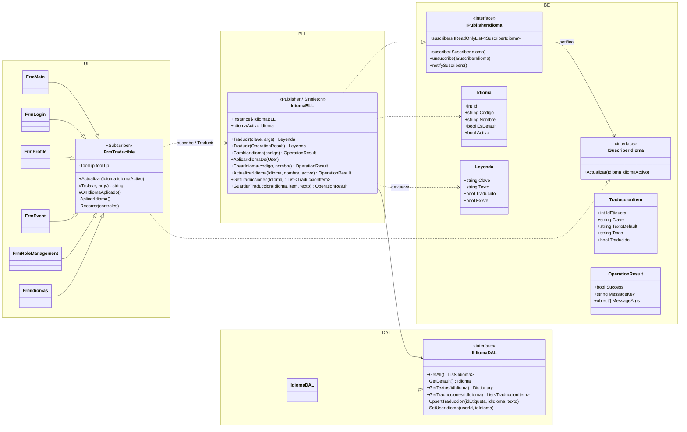

# DC - Gestión de idiomas con patrón Observer (T05)

## Objetivo

Un modelo de idiomas **reutilizable y desacoplado de la UI**: la lógica de traducción vive en la BLL y solo
conoce una interfaz (`ISuscriberIdioma`). Los formularios se suscriben, y cuando cambia el idioma el publisher los
notifica a todos. Sin hojas de recursos: los textos salen de la base.

## Patrón Observer

Mismo esquema que `parcial_1/Ejercicio-practicos/PatronObserver2` (Materia = publisher, Alumno = suscriber),
adaptado a capas:

| Rol en el ejemplo | Ejemplo `PatronObserver2` | Este proyecto | Capa |
|---|---|---|---|
| Interfaz del publisher | `IPublisherMateria` | `IPublisherIdioma` | BE (`BE.Observer`) |
| Interfaz del suscriber | `ISuscriberAlumno` | `ISuscriberIdioma` | BE (`BE.Observer`) |
| Publisher concreto | `Materia` | `IdiomaBLL` | BLL |
| Suscriber concreto | `Alumno` | `FrmTraducible` (y por herencia todos los formularios) | UI |
| Dispara la notificación | setter de `DiaSemana` | `CambiarIdioma(...)` / traducción editada del idioma en uso | BLL |

Diferencias deliberadas respecto del ejemplo:

- `Actualizar` recibe el **`Idioma`** nuevo y no el publisher concreto (el ejemplo recibe `Materia`): el suscriber no se acopla a la BLL.
- El publisher **no** conoce el formulario ni usa `Application.OpenForms`; solo recorre su lista de `ISuscriberIdioma`.
- `notifySuscribers` itera una copia de la lista: un formulario puede cerrarse (y desuscribirse) mientras se lo notifica.
- Comparte la forma del ejemplo: `suscribe` / `unsuscribe` / `notifySuscribers`, lista de solo lectura y `Exception` por suscripción duplicada o inexistente.

## Cómo funciona

**Instancia compartida.** Todos los formularios deben suscribirse al *mismo* publisher, por eso `IdiomaBLL.Instance`
(inicialización perezosa). El constructor con `IIdiomaDAL` es público para los tests.

**Carga.** Al elegir un idioma se hacen dos consultas (`GetTextos` del elegido y del default) y se guardan en dos
diccionarios en memoria. Traducir una etiqueta es una búsqueda en diccionario, no una consulta; el estado se pisa
recién cuando ambas consultas terminaron, así una falla no deja la caché a medias.

**Resolución de una etiqueta** (`Traducir`):

1. Está en el idioma activo → `Leyenda(Traducido = true)`.
2. No está, pero sí en el default → texto del default con `Traducido = false` (si el activo *es* el default, `true`).
3. No existe en ninguno → la propia clave con `Existe = false`.
4. Si hay argumentos se aplica `string.Format`; un texto mal cargado (`FormatException`) se devuelve sin formatear.

**Cómo sabe el front que algo no está traducido.** `Leyenda.Traducido` viaja con el texto. `FrmTraducible` agrega un
tooltip «Sin traducir» a los controles cuya leyenda cayó al default; la bandera queda disponible para
cualquier otro consumidor sin que tenga que consultar nada más.

**Qué traduce `FrmTraducible`.** Por convención, sin tocar los Designer: la clave de un control es
`<NombreDelFormulario>.<control.Name>` y la del título `<NombreDelFormulario>.Title`. `AplicarIdioma` recorre
**recursivamente** los controles (paneles, grupos) y los ítems de `MenuStrip`/`ToolStrip`/`StatusStrip` y sus
submenús. Un control sin etiqueta en la base conserva su texto de diseño. Lo que arma el código (saludos, estados,
encabezados de grilla, nodos de árbol) se refresca en el gancho `OnIdiomaAplicado`.

**Mensajes de la BLL.** La BLL no devuelve texto: `OperationResult` lleva `MessageKey` y `MessageArgs`, y la UI llama
`T(resultado)`. La BLL queda sin dependencia del idioma activo.

**Ciclo de vida del suscriptor.** `OnLoad` → `suscribe` + `AplicarIdioma`; `OnFormClosed` → `unsuscribe`. Un formulario
cerrado nunca recibe notificaciones.

**Administración.** Las operaciones de `IdiomaBLL` que escriben exigen `GESTIONAR_IDIOMAS` y quedan en bitácora
(`CrearIdioma`, `ModificarIdioma`, `ActualizarTraduccion`, `CambiarIdioma`). Editar una traducción del idioma en uso
(o del default, que es el respaldo) recarga los diccionarios y notifica.
