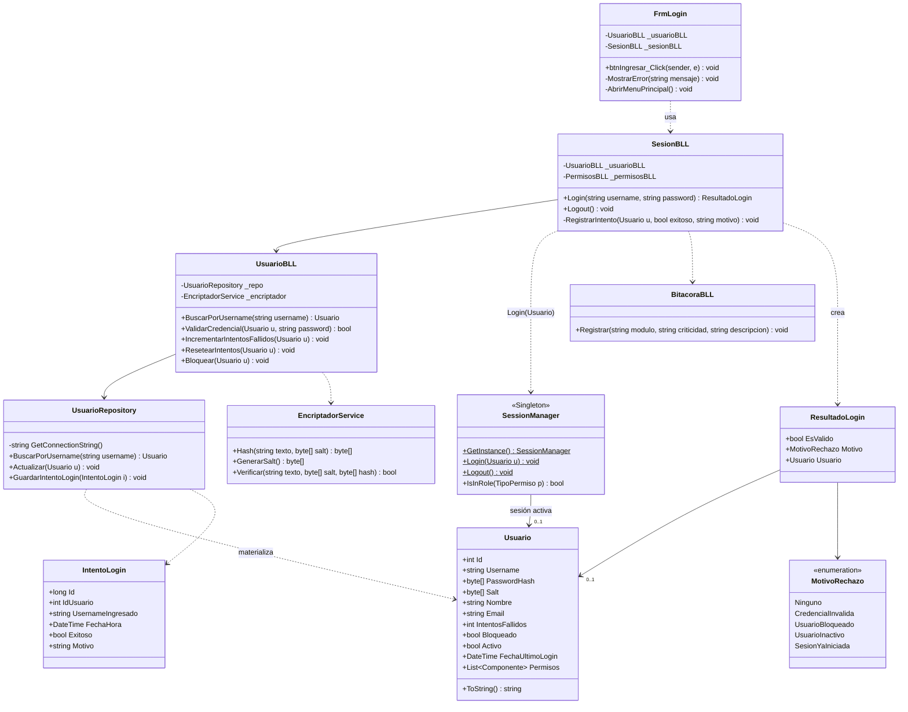

# DC - Diagrama de clases: Login

Arquitectura en capas (UI → BLL → DAL → BE) del Caso de Uso Login.
La UI **no** conoce la DAL y la BLL **no** conoce controles visuales.

## Responsabilidades

| Clase | Responsabilidad única |
|---|---|
| `FrmLogin` | Capturar credenciales y mostrar resultados. Nada de lógica. |
| `SesionBLL` | Orquestar el login: validar, bloquear, auditar, abrir sesión. |
| `UsuarioBLL` | Reglas del usuario (credencial, intentos, bloqueo). |
| `UsuarioRepository` | Único punto que habla SQL. |
| `EncriptadorService` | Hash + salt. La contraseña en claro nunca sale de acá. |
| `SessionManager` | Instancia única de sesión (ver [DC-sesion-singleton.md](DC-sesion-singleton.md)). |

> `SesionBLL` devuelve un `ResultadoLogin` en vez de lanzar excepciones para los
> casos de negocio esperables (credencial inválida, usuario bloqueado): una
> credencial mal tipeada no es un caso excepcional.
