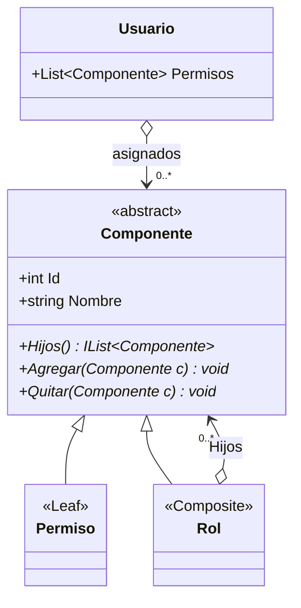
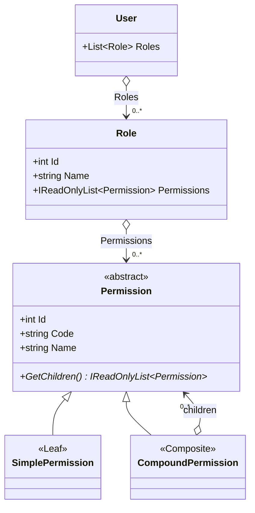

# DC - Modelo I vs Modelo II de roles y permisos

El boceto de la cátedra (`Entrega_2/roles_y_permisos_2_formas.jpeg`) propone dos
formas de modelar roles y permisos. **El proyecto implementa el Modelo II**. Este
documento deja registrado cómo se diferencian y qué habría que tocar si en algún
momento se decide migrar al Modelo I.

## Modelo I - un solo Componente (Rol = permiso compuesto)

Todo es un `Componente`: el rol es sólo una agrupación más. El usuario se asocia
directamente a componentes.

Es el modelo del ejemplo de la cátedra (`Familia`/`Patente`) y de la pantalla de
referencia: *ROLES (Familias)* y *PERMISOS SIMPLES (Patentes)* en un mismo
catálogo, con un botón *Crear Rol Anidado* (un rol dentro de otro).

## Modelo II - Rol separado (el implementado)

El rol **no** es parte del Composite. El Composite vive sólo entre permisos
(simple / compuesto) y el rol los agrega.

## Comparación

| Aspecto | Modelo I | Modelo II (implementado) |
|---|---|---|
| Tipos | `Componente` → `Permiso`, `Rol` | `Permission` → `SimplePermission`, `CompoundPermission`; `Role` aparte |
| ¿Qué es un rol? | Un composite más | Entidad propia que agrega permisos |
| Permiso complejo vs rol | **No se distinguen** estructuralmente | Se distinguen: el compuesto agrupa permisos, el rol se asigna a usuarios |
| Rol dentro de rol (anidado) | Sí, naturalmente | No (se logra con un permiso compuesto compartido) |
| Usuario se asocia a | Cualquier componente (rol o permiso suelto) | Sólo roles |
| ABM | Crear/borrar roles = crear/borrar composites | ABM de `Role`; el catálogo de permisos es fijo |
| Tablas | `Permiso` (con `EsFamilia`), `Permiso_Permiso`, `Usuario_Permiso` | `Permission`, `Permission_Permission`, `Role`, `Role_Permission`, `User_Role` |
| Verificación | `usuario.Componentes.Any(c => c.Tiene(x))` | `usuario.Roles.Any(r => r.Grants(x))` (un nivel más) |
| Riesgo | Se puede asignar un permiso suelto a un usuario y se pierde el concepto de rol | Más tablas y una clase más |

## Cómo migrar al Modelo I (si hiciera falta)

1. **Entidades (BE)**: eliminar `Role` y hacer que `CompoundPermission` represente
   también al rol (por ejemplo con una propiedad `IsRole`). `User.Roles` pasa a
   ser `User.Permissions : List<Permission>` y `User.HasPermission` itera sobre ella.
2. **SQL**: `Role` y `Role_Permission` desaparecen; los roles pasan a ser filas de
   `[Permission]` con `IsCompound = 1` (+ flag `IsRole`) y sus permisos a
   `[Permission_Permission]`. `[User_Role]` se reemplaza por `[User_Permission]`
   (`UserId`, `PermissionId`) con FK a `[Permission]`. El seed se reescribe con
   los mismos datos.
3. **DAL**: `RoleDAL` se reduce a consultas sobre `[Permission]` filtrando `IsRole`;
   `PermissionDAL.FillChildren` ya arma árboles de cualquier profundidad, por lo
   que no cambia.
4. **BLL**: `RoleBLL` conserva sus operaciones pero opera sobre `CompoundPermission`.
   Aparece la validación de ciclos también para roles (rol anidado), que ya
   existe en `CompoundPermission.Add`.
5. **UI**: `FrmRoleManagement` ya tiene los tres árboles; se agrega el botón
   *Crear Rol Anidado* y *Quitar Permiso de Rol* pasa a *Quitar de Rol* (sirve
   para permisos y roles). `MostrarRecursivo` no cambia.
6. **Tests**: `HasPermission` y `Flatten` siguen valiendo; se agregan casos de rol anidado.

## Diagramas relacionados

- Clases (Modelo II): [DC-permisos-composite.md](DC-permisos-composite.md)
- Datos: [DER-permisos-composite.md](../DER%20-%20Diagrama%20entidad%20relación/DER-permisos-composite.md)
