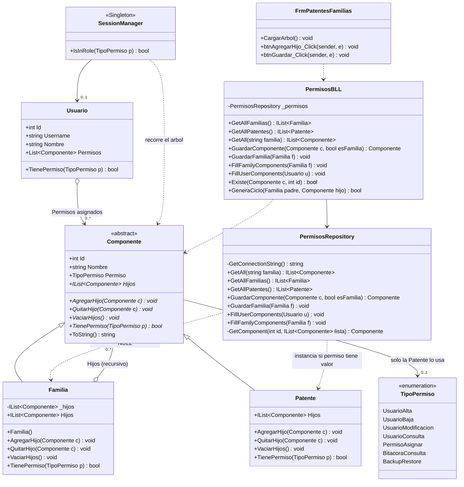

# DC - Diagrama de clases: Permisos RBAC (patrón Composite)

Aplicación del **Composite** a *Familia / Patente*: el cliente (`SessionManager`,
la UI, la BLL) trata igual a un permiso simple y a un rol completo, porque ambos
son un `Componente`.

| Rol en el patrón | Clase | Qué es en el dominio |
|---|---|---|
| *Component* | `Componente` (abstracta) | Permiso genérico |
| *Leaf* | `Patente` | Permiso atómico sobre una acción del sistema |
| *Composite* | `Familia` | Rol / agrupación de patentes y otras familias |
| *Client* | `SessionManager`, `PermisosBLL`, `FrmPatentesFamilias` | Consumen la interfaz `Componente` |



## Implementación de `TienePermiso` (la operación uniforme)

```csharp
// Patente (Leaf): hace el trabajo real, no tiene a quién delegar
public override bool TienePermiso(TipoPermiso p) => Permiso.Equals(p);

// Familia (Composite): delega en los hijos y compone el resultado
public override bool TienePermiso(TipoPermiso p)
{
    foreach (var hijo in _hijos)
        if (hijo.TienePermiso(p)) return true;
    return false;
}
```

El cliente escribe siempre lo mismo, sin preguntar de qué tipo es el permiso:

```csharp
if (SessionManager.GetInstance.IsInRole(TipoPermiso.UsuarioAlta)) { ... }
```

## Notas de diseño

- `Patente.Hijos` devuelve una lista vacía y `AgregarHijo()` no hace nada: es la
  variante "interfaz uniforme" del Composite (transparencia por sobre seguridad).
  La alternativa es lanzar `NotSupportedException`.
- `Familia.Hijos` devuelve una **copia** (`_hijos.ToArray()`) para que nadie
  modifique la colección interna sin pasar por `AgregarHijo` / `QuitarHijo`.
- El recorrido es en profundidad y **corta en el primer match**, por eso el
  costo real es mucho menor que recorrer todo el árbol.
- `GeneraCiclo()` se valida **antes** de armar la relación padre-hijo: sin eso,
  un ciclo cuelga el recorrido recursivo con `StackOverflowException`.
- El árbol vive en memoria dentro de `Usuario.Permisos`; la persistencia se
  describe en [DER-permisos-composite.md](../DER%20-%20Diagrama%20entidad%20relación/DER-permisos-composite.md).
