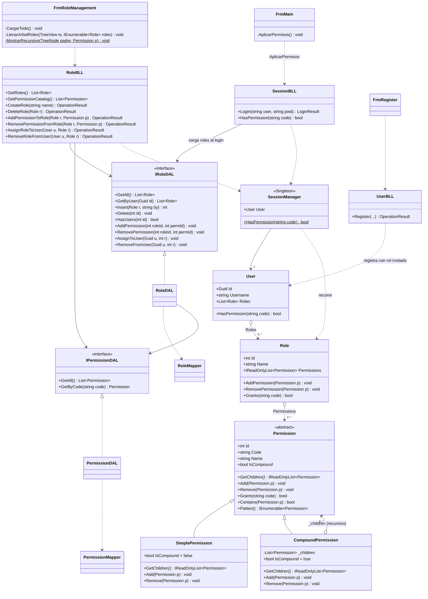

# DC - Diagrama de clases: Perfiles de usuario (T04, patrón Composite)

## Objetivo

Que cada usuario tenga uno o más **roles** y que cada rol otorgue **permisos**
simples o compuestos, de modo que el sistema pueda (a) decidir qué opciones
mostrar y ejecutar, y (b) mostrar el árbol de permisos en un `TreeView` mediante
funciones recursivas. Se implementa el **Modelo II** (el Rol es una entidad
aparte que agrega permisos); el Modelo I (rol = permiso compuesto) está
documentado como alternativa en [DC-modelo-I-vs-II-permisos.md](DC-modelo-I-vs-II-permisos.md).

## Aplicación del patrón

| Rol en el patrón | Clase (`BE.Entity`) | Qué es en el dominio |
|---|---|---|
| *Component* | `Permission` (abstracta) | Un permiso genérico (simple o compuesto) |
| *Leaf* | `SimplePermission` | Permiso atómico sobre una acción (ej. `GESTIONAR_ROLES`) |
| *Composite* | `CompoundPermission` | Agrupa permisos simples y/u otros compuestos (ej. `SESION_BASICA`) |
| *Client* | `Role`, `User`, `SessionManager`, `FrmRoleManagement` | Tratan igual a un permiso simple y a uno compuesto |

El `Role` **no** es parte del Composite: es el contenedor raíz que agrega
`Permission`. Un `User` tiene N roles (relación N:M).

> Equivalencia con los nombres del ejemplo de la cátedra: `ComponentePermiso` →
> `Permission`, `PatenteBE` → `SimplePermission`, `FamiliaBE` →
> `CompoundPermission`, `AgregarHijo/RemoverHijo/ObtenerHijos` →
> `Add/Remove/GetChildren`. La clase `Familia` del ejemplo hacía de rol *y* de
> agrupación; acá se separan (Modelo II).

## Diagrama de clases


```mermaid
classDiagram
    direction TB

    class Permission {
        <<abstract>>
        +int Id
        +string Code
        +string Name
        +bool IsCompound*
        +GetChildren()* IReadOnlyList~Permission~
        +Add(Permission p)* void
        +Remove(Permission p)* void
        +Grants(string code) bool
        +Contains(Permission p) bool
        +Flatten() IEnumerable~Permission~
    }

    class SimplePermission {
        +bool IsCompound = false
        +GetChildren() IReadOnlyList~Permission~
        +Add(Permission p) void
        +Remove(Permission p) void
    }

    class CompoundPermission {
        -List~Permission~ _children
        +bool IsCompound = true
        +GetChildren() IReadOnlyList~Permission~
        +Add(Permission p) void
        +Remove(Permission p) void
    }

    class Role {
        +int Id
        +string Name
        +IReadOnlyList~Permission~ Permissions
        +AddPermission(Permission p) void
        +RemovePermission(Permission p) void
        +Grants(string code) bool
    }

    class User {
        +Guid Id
        +string Username
        +List~Role~ Roles
        +HasPermission(string code) bool
    }

    class SessionManager {
        <<Singleton>>
        +User User
        +HasPermission(string code)$ bool
    }

    class RoleBLL {
        +GetRoles() List~Role~
        +GetPermissionCatalog() List~Permission~
        +CreateRole(string name) OperationResult
        +DeleteRole(Role r) OperationResult
        +AddPermissionToRole(Role r, Permission p) OperationResult
        +RemovePermissionFromRole(Role r, Permission p) OperationResult
        +AssignRoleToUser(User u, Role r) OperationResult
        +RemoveRoleFromUser(User u, Role r) OperationResult
    }

    class UserBLL {
        +Register(...) OperationResult
    }

    class SessionBLL {
        +Login(string user, string pwd) LoginResult
        +HasPermission(string code) bool
    }

    class IPermissionDAL {
        <<interface>>
        +GetAll() List~Permission~
        +GetByCode(string code) Permission
    }

    class IRoleDAL {
        <<interface>>
        +GetAll() List~Role~
        +GetByUser(Guid id) List~Role~
        +Insert(Role r, string by) int
        +Delete(int id) void
        +HasUsers(int id) bool
        +AddPermission(int roleId, int permId) void
        +RemovePermission(int roleId, int permId) void
        +AssignToUser(Guid u, int r) void
        +RemoveFromUser(Guid u, int r) void
    }

    class PermissionDAL
    class RoleDAL
    class PermissionMapper
    class RoleMapper

    class FrmRoleManagement {
        -CargarTodo() void
        -LlenarArbolRoles(TreeView tv, IEnumerable~Role~ roles) void
        -MostrarRecursivo(TreeNode padre, Permission p)$ void
    }
    class FrmRegister
    class FrmMain {
        -AplicarPermisos() void
    }

    Permission <|-- SimplePermission
    Permission <|-- CompoundPermission
    CompoundPermission o--> "0..*" Permission : _children (recursivo)
    Role o--> "0..*" Permission : Permissions
    User o--> "0..*" Role : Roles
    SessionManager --> "1" User
    SessionManager ..> Role : recorre
    IPermissionDAL <|.. PermissionDAL
    IRoleDAL <|.. RoleDAL
    PermissionDAL ..> PermissionMapper
    RoleDAL ..> RoleMapper
    RoleDAL --> IPermissionDAL
    RoleBLL --> IRoleDAL
    RoleBLL --> IPermissionDAL
    RoleBLL ..> SessionManager : autoriza
    UserBLL ..> User : registra con rol invitado
    SessionBLL --> IRoleDAL : carga roles al login
    SessionBLL ..> SessionManager
    FrmRoleManagement ..> RoleBLL
    FrmRegister ..> UserBLL
    FrmMain ..> SessionBLL : AplicarPermisos
```

## Algoritmos recursivos

**Verificación (corta en el primer match)** — `Permission.Grants`:

```csharp
public bool Grants(string code)
{
    if (Code == code) return true;                 // este nodo (hoja o compuesto)
    foreach (var child in GetChildren())           // hoja: lista vacía, corta la recursión
        if (child.Grants(code)) return true;
    return false;
}
// Role.Grants(code)  => Permissions.Any(p => p.Grants(code))
// User.HasPermission => Roles.Any(r => r.Grants(code))
```

**Armado del árbol en memoria** — `PermissionDAL.FillChildren`: se leen
`[Permission]` y `[Permission_Permission]` y cada compuesto se llena a sí mismo
descendiendo por sus hijos (equivalente al `LlenarFamiliaComponentes` del ejemplo).

**Presentación en `TreeView`** — `FrmRoleManagement.MostrarRecursivo`:

```csharp
private static void MostrarRecursivo(TreeNode nodoPadre, Permission permiso)
{
    var nodo = new TreeNode(permiso.Name) { Tag = permiso };
    nodoPadre.Nodes.Add(nodo);
    foreach (var hijo in permiso.GetChildren())    // el Leaf no tiene hijos
        MostrarRecursivo(nodo, hijo);
}
```

**Aplanado para la bitácora** — `Permission.Flatten` devuelve sólo las hojas;
`BitacoraManager.AplanarRolesPermisos` lo usa para completar
`Bitacora.RolesPermisos` ("Roles: client | Permisos: VER_MI_PERFIL, ...").

## Reglas de negocio

- **Catálogo de permisos fijo**: no hay alta, baja ni modificación de permisos
  (simples ni compuestos); se siembran con `sql/04_init_create_roles_permission.sql`.
  Sólo se **agregan o quitan** permisos a un rol. El ABM completo es de **roles**.
- Un rol no se elimina si tiene usuarios asignados ni si es `invitado`.
- No se puede agregar a un rol un permiso que ya otorga (directo o por un
  compuesto), ni quitar uno que no esté asignado directamente.
- Un administrador no puede quitarse a sí mismo un rol que otorga `GESTIONAR_ROLES`.
- Todo usuario que se registra recibe el rol `invitado` (sólo *Mi perfil* y *Cerrar sesión*).
- Cada operación valida el permiso en la **BLL** (no sólo oculta el menú) y deja
  rastro en bitácora; un intento sin permiso queda como `AccesoNoAutorizado`.

## Notas de diseño

- `SimplePermission.Add/Remove` lanzan `InvalidOperationException` (variante
  *seguridad* del Composite) en lugar de ignorar la llamada: es un error de
  programación intentar colgar hijos de una hoja.
- `CompoundPermission.GetChildren()` devuelve una vista de sólo lectura para que
  nadie altere la colección sin pasar por `Add/Remove`; `Add` rechaza duplicados
  y **ciclos** (un compuesto no puede contenerse a sí mismo, directa o indirectamente).
- Limitación conocida: si un administrador cambia los roles del usuario que tiene
  la sesión abierta, el cambio se ve en su próximo inicio de sesión (los roles
  se cargan una vez, en `SessionBLL.Login`).

## Diagramas relacionados

- Datos: [DER-permisos-composite.md](../DER%20-%20Diagrama%20entidad%20relación/DER-permisos-composite.md)
- Secuencia: [DS-permisos-composite.md](../DS%20-%20Diagramas%20de%20secuencia/DS-permisos-composite.md)
- Casos de uso: [CU-gestion-perfiles.md](../CU%20-%20Casos%20de%20uso/CU-gestion-perfiles.md)
- Alternativa: [DC-modelo-I-vs-II-permisos.md](DC-modelo-I-vs-II-permisos.md)
