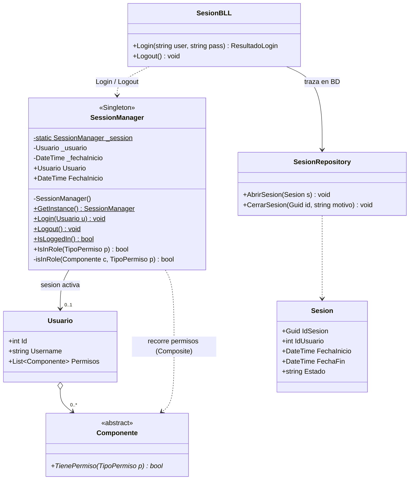

# DC - Diagrama de clases: SessionManager (Singleton)

`SessionManager` implementa el patrón **Singleton**: existe una y sólo una sesión
activa mientras la aplicación está en ejecución. Cualquier capa del sistema puede
preguntar quién está logueado y qué permisos tiene sin necesidad de ir pasando el
objeto `Usuario` por parámetro.



## Elementos del patrón

| Elemento | Para qué |
|---|---|
| Constructor `private` | Nadie fuera de la clase puede hacer `new SessionManager()` |
| Campo `static _session` | Guarda la única instancia existente |
| `GetInstance` estático | Único punto de acceso a la sesión; si no hay sesión iniciada, lanza excepción |
| `Login(Usuario)` estático | Crea la instancia con el usuario autenticado; si ya existe, lanza excepción |
| `Logout()` estático | Destruye la instancia y deja el sistema sin sesión |

## Implementación

```csharp
public class SessionManager
{
    private static SessionManager _session;

    public Usuario Usuario { get; set; }
    public DateTime FechaInicio { get; set; }

    private SessionManager() { }

    public static SessionManager GetInstance
    {
        get
        {
            if (_session == null) throw new Exception("Sesión no iniciada");
            return _session;
        }
    }

    public static void Login(Usuario usuario)
    {
        if (_session == null)
        {
            _session = new SessionManager();
            _session.Usuario = usuario;
            _session.FechaInicio = DateTime.Now;
        }
        else
        {
            throw new Exception("Sesión ya iniciada");
        }
    }

    public static void Logout()
    {
        if (_session != null) _session = null;
        else throw new Exception("Sesión no iniciada");
    }
}
```

## Notas de diseño

- **Sin sincronización de hilos**: el Login y el Logout no usan `lock`. La
  aplicación es de escritorio y mono-hilo: sólo el hilo de la interfaz crea o
  destruye la sesión, por lo que no hay dos hilos compitiendo por la instancia.
- **Un Singleton por proceso, no por usuario**: el diseño es válido porque el
  sistema es una aplicación de escritorio mono-usuario. En una aplicación web
  sería un error grave, porque todos los usuarios compartirían la sesión.
- `IsInRole` recorre el árbol de permisos del usuario, que es un Composite
  (ver [DC-permisos-composite.md](DC-permisos-composite.md)), por lo que la
  sesión no necesita saber si el permiso asignado es una patente o una familia.
- La sesión vive en memoria; en la base de datos sólo queda su traza
  (ver [DER-sesion.md](../DER%20-%20Diagrama%20entidad%20relación/DER-sesion.md)).
