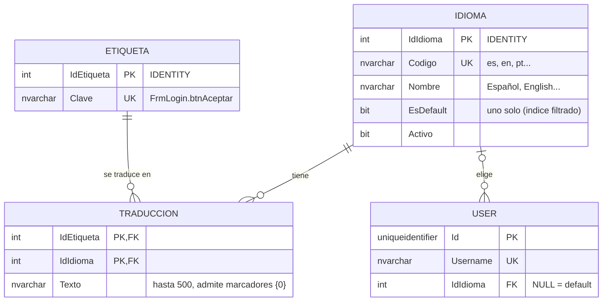

# DER - Idiomas (T05)

Persistencia de los idiomas y de sus textos. Script: `sql/05_create_idiomas.sql` (idempotente; lo corre `sql/init-db.sh`).

Modelo mínimo de tres tablas:

- **`Idioma`**: idiomas disponibles. Exactamente uno tiene `EsDefault = 1` (índice único filtrado `UX_Idioma_Default`): es el respaldo de todos los demás.
- **`Etiqueta`**: la clave estable que usa el sistema para pedir un texto (`FrmLogin.btnAceptar`, `msg.role.created`...). El código nunca conoce el texto, solo la clave.
- **`Traduccion`**: el texto de una etiqueta en un idioma. Es la resolución de la relación N:M entre `Etiqueta` e `Idioma`; su clave primaria compuesta impide dos textos para el mismo par.

**Una etiqueta sin fila en `Traduccion` para un idioma = pendiente de traducir.** No se guardan filas vacías: así «lo que falta» es una consulta y no un estado a mantener.
El usuario referencia su idioma con `[User].IdIdioma` (nullable: `NULL` = idioma por defecto).

## Normalización

3FN: `Idioma` y `Etiqueta` dependen solo de su clave; en `Traduccion` el texto depende de la clave completa (`IdEtiqueta`, `IdIdioma`), sin atributos que dependan de una parte. `Codigo` y `Clave` son claves candidatas (`UNIQUE`).

## Convención de claves

| Patrón | Ejemplo | Quién lo usa |
|---|---|---|
| `<Formulario>.<control>` | `FrmLogin.btnAceptar` | `FrmTraducible` lo aplica solo al `Name` del control |
| `<Formulario>.Title` | `FrmMain.Title` | título del formulario |
| `<Formulario>.<algo>` | `FrmProfile.estadoActivo` | textos que arma el código del formulario |
| `FrmEvent.col.<Propiedad>` | `FrmEvent.col.Fecha` | encabezados de grillas |
| `msg.*` | `msg.role.created` | mensajes de la BLL (`OperationResult.MessageKey`) y mensajes generales |

## Datos sembrados

- Idiomas `es` (default) y `en`.
- Todas las etiquetas de las pantallas migradas con su texto en español.
- Inglés **parcial a propósito** (Login, menú principal, mensajes de acceso): el resto queda pendiente para cargarlo desde la pantalla de administración.
- Permiso `GESTIONAR_IDIOMAS` asignado al rol `administrador`.
