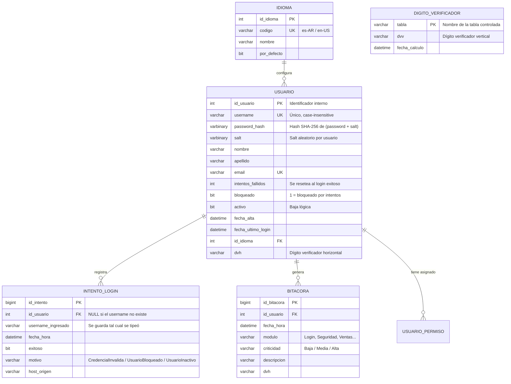

# DER - Login / Autenticación

Modelo de datos que soporta el Caso de Uso **Login**: credenciales, control de
intentos fallidos, bloqueo de usuario y trazabilidad (bitácora).

- La contraseña **nunca** se guarda en claro: se persiste `password_hash` + `salt`
  (calculados por `EncriptadorService`).
- `intentos_fallidos` y `bloqueado` implementan la política de bloqueo por
  N intentos erróneos consecutivos.
- `dvh` (dígito verificador horizontal) por registro y `DIGITO_VERIFICADOR`
  (vertical) por tabla dan integridad ante modificaciones fuera del sistema.

## Reglas de integridad

| Regla | Implementación |
|---|---|
| Un username no se repite | `UNIQUE (username)` |
| No se guarda la contraseña en claro | Sólo `password_hash` + `salt` |
| Bloqueo automático | `intentos_fallidos >= 3` ⇒ `bloqueado = 1` |
| Reset de intentos | Login exitoso ⇒ `intentos_fallidos = 0` |
| Todo intento queda registrado | Insert en `INTENTO_LOGIN` (exitoso o no) |

> `USUARIO_PERMISO` se detalla en [DER-permisos-composite.md](DER-permisos-composite.md).
