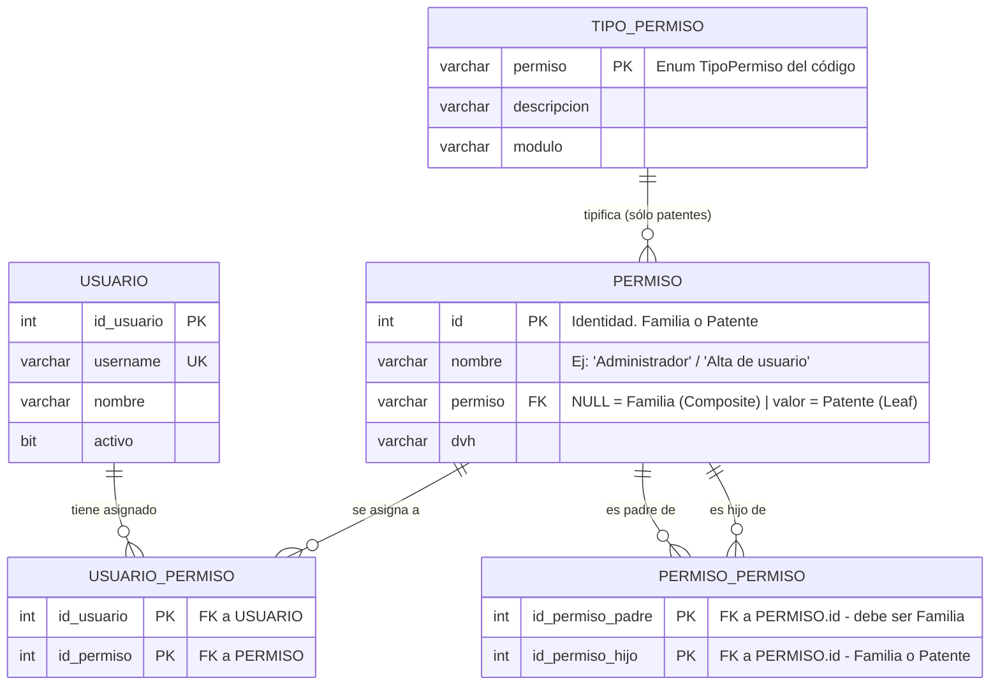

# DER - Permisos (RBAC con patrón Composite)

Modelo de **Roles / Familias / Patentes** persistido con el patrón *Composite*.

La clave del diseño es que **Familia y Patente comparten una única tabla**
(`PERMISO`), porque en el Composite ambas son el mismo tipo `Componente`.
Se distinguen por el campo `permiso`:

| Caso | `PERMISO.permiso` | Rol en el Composite |
|---|---|---|
| **Patente** (hoja) | tiene valor (`UsuarioAlta`, `VentaConsulta`, ...) | *Leaf* |
| **Familia** (rol) | `NULL` | *Composite* |

La jerarquía (una familia contiene patentes y/u otras familias) se resuelve con
la tabla de auto-relación `PERMISO_PERMISO` (padre → hijo), que permite un árbol
de N niveles. La asignación a usuarios se hace con `USUARIO_PERMISO`, y puede
apuntar tanto a una familia como a una patente suelta.



## Restricciones que no se ven en el diagrama

1. **Un hijo puede tener varios padres** (una patente se reutiliza en varias
   familias) ⇒ `PERMISO_PERMISO` es N:M, no un simple `id_padre` en `PERMISO`.
2. **Prohibido el ciclo**: antes de insertar en `PERMISO_PERMISO` la BLL valida
   con recorrido recursivo (`PermisosBLL.Existe`) que el hijo no contenga ya al
   padre; si no, el árbol se vuelve infinito al recorrerlo.
3. **Sólo las familias tienen hijos**: `id_permiso_padre` debe referenciar una
   fila con `permiso IS NULL` (chequeo por trigger o por BLL). La `Patente`
   igual implementa `AgregarHijo()` pero no hace nada (Leaf).
4. **Un permiso no se repite dentro de la misma familia**: PK compuesta.

## Consulta recursiva de armado del árbol

La reconstrucción del Composite desde la BD se hace con un CTE recursivo
(así lo hace `PermisosRepository.GetAll`):

```sql
WITH recursivo AS (
    SELECT pp.id_permiso_padre, pp.id_permiso_hijo
    FROM   permiso_permiso pp
    WHERE  pp.id_permiso_padre = @idFamilia
    UNION ALL
    SELECT pp.id_permiso_padre, pp.id_permiso_hijo
    FROM   permiso_permiso pp
    INNER JOIN recursivo r ON r.id_permiso_hijo = pp.id_permiso_padre
)
SELECT r.id_permiso_padre, r.id_permiso_hijo, p.id, p.nombre, p.permiso
FROM   recursivo r
INNER JOIN permiso p ON r.id_permiso_hijo = p.id;
```
