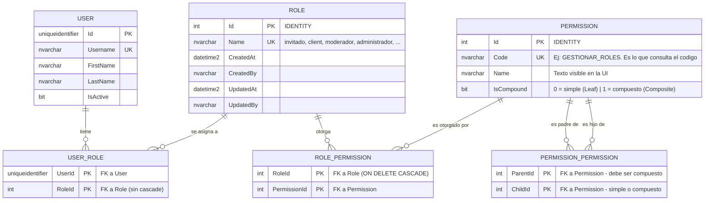

# DER - Roles y permisos (T04, Composite - Modelo II)

Persistencia de roles y del árbol de permisos. Script: `sql/04_init_create_roles_permission.sql`.

Los permisos simples y compuestos comparten una única tabla (`Permission`)
porque en el Composite ambos son el mismo tipo `Permission`; se distinguen con
`IsCompound`. La jerarquía (un compuesto agrupa simples y/u otros compuestos) se
resuelve con la auto-relación `Permission_Permission` (padre → hijo), que permite
N niveles. El **rol** es una tabla aparte (`Role`) y agrega permisos mediante
`Role_Permission`; el usuario tiene N roles mediante `User_Role`.

| Caso | `Permission.IsCompound` | Rol en el Composite |
|---|---|---|
| Permiso simple | `0` | *Leaf* |
| Permiso compuesto | `1` | *Composite* |


```mermaid
erDiagram
    USER ||--o{ USER_ROLE : "tiene"
    ROLE ||--o{ USER_ROLE : "se asigna a"
    ROLE ||--o{ ROLE_PERMISSION : "otorga"
    PERMISSION ||--o{ ROLE_PERMISSION : "es otorgado por"
    PERMISSION ||--o{ PERMISSION_PERMISSION : "es padre de"
    PERMISSION ||--o{ PERMISSION_PERMISSION : "es hijo de"

    USER {
        uniqueidentifier Id PK
        nvarchar Username UK
        nvarchar FirstName
        nvarchar LastName
        bit IsActive
    }

    ROLE {
        int Id PK "IDENTITY"
        nvarchar Name UK "invitado, client, moderador, administrador, ..."
        datetime2 CreatedAt
        nvarchar CreatedBy
        datetime2 UpdatedAt
        nvarchar UpdatedBy
    }

    PERMISSION {
        int Id PK "IDENTITY"
        nvarchar Code UK "Ej: GESTIONAR_ROLES. Es lo que consulta el codigo"
        nvarchar Name "Texto visible en la UI"
        bit IsCompound "0 = simple (Leaf) | 1 = compuesto (Composite)"
    }

    PERMISSION_PERMISSION {
        int ParentId PK "FK a Permission - debe ser compuesto"
        int ChildId PK "FK a Permission - simple o compuesto"
    }

    ROLE_PERMISSION {
        int RoleId PK "FK a Role (ON DELETE CASCADE)"
        int PermissionId PK "FK a Permission"
    }

    USER_ROLE {
        uniqueidentifier UserId PK "FK a User"
        int RoleId PK "FK a Role (sin cascade)"
    }
```

## Restricciones que no se ven en el diagrama

1. **Un hijo puede tener varios padres** (un permiso se reutiliza en varios
   compuestos) ⇒ `Permission_Permission` es N:M, con PK compuesta (no se repite
   dentro del mismo padre).
2. **`CK_Permission_Permission_NoSelf`**: `ParentId <> ChildId`. Los ciclos de más
   de un nivel los rechaza `CompoundPermission.Add` en memoria.
3. **Sólo los compuestos tienen hijos**: se garantiza por diseño (el catálogo se
   siembra por script y la aplicación no lo modifica).
4. **Rol con usuarios no se borra**: `User_Role → Role` no tiene `ON DELETE
   CASCADE` (la BLL además lo valida y informa). `Role_Permission` sí cae en cascada.
5. **`Permission.Code` es único e inmutable**: el código fuente referencia los
   códigos (`BE.Entity.PermissionCode`).
6. **Normalización**: 3FN; todas las relaciones N:M tienen tabla intermedia con
   integridad referencial.

## Datos sembrados

| Rol | Permisos |
|---|---|
| `invitado` | `SESION_BASICA` (compuesto: `VER_MI_PERFIL` + `CERRAR_SESION`) |
| `client` | `SESION_BASICA`, `VER_LANDING_PAGE` |
| `moderador` | `SESION_BASICA`, `VER_LANDING_PAGE`, `VER_BITACORA` |
| `administrador` | todo lo del moderador + `GESTIONAR_ROLES`, `ASIGNAR_ROLES_USUARIO` |

El script es idempotente (no dropea): reejecutarlo no pierde roles ni asignaciones
creados desde la aplicación. Si existe el usuario `admin` (ver `sql/create-user.sh`)
queda con el rol `administrador`.

## Consulta recursiva de armado del árbol

`PermissionDAL` arma el árbol en memoria con dos consultas (`[Permission]` y
`[Permission_Permission]`). Equivalente en SQL con CTE recursivo, para un compuesto dado:

```sql
WITH recursivo AS (
    SELECT pp.ParentId, pp.ChildId
    FROM   [Permission_Permission] pp
    WHERE  pp.ParentId = @ParentId
    UNION ALL
    SELECT pp.ParentId, pp.ChildId
    FROM   [Permission_Permission] pp
    INNER JOIN recursivo r ON r.ChildId = pp.ParentId
)
SELECT r.ParentId, r.ChildId, p.Code, p.Name, p.IsCompound
FROM   recursivo r
INNER JOIN [Permission] p ON r.ChildId = p.Id;
```

## Diagramas relacionados

- Clases: [DC-permisos-composite.md](../DC%20-%20Diagrama%20de%20clases/DC-permisos-composite.md)
- Secuencia: [DS-permisos-composite.md](../DS%20-%20Diagramas%20de%20secuencia/DS-permisos-composite.md)
- Alternativa (Modelo I): [DC-modelo-I-vs-II-permisos.md](../DC%20-%20Diagrama%20de%20clases/DC-modelo-I-vs-II-permisos.md)
