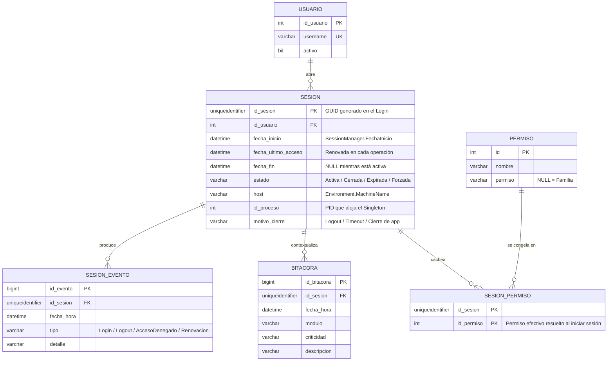

# DER - Sesión (SessionManager)

`SessionManager` es un **Singleton en memoria**: dentro del proceso existe una y
sólo una sesión activa. La base de datos **no** almacena el objeto sesión, sino
su *traza*: cuándo se abrió, con qué usuario, desde qué host/proceso y cuándo se
cerró. Eso permite auditar, detectar sesiones abiertas sin cierre e impedir el
login simultáneo del mismo usuario desde dos puestos.

## Reglas

| Regla | Motivo |
|---|---|
| A lo sumo una `SESION` con `estado = 'Activa'` por proceso | Es el reflejo en BD de la instancia única del Singleton |
| `UNIQUE (id_usuario) WHERE estado = 'Activa'` (índice filtrado) | Evita login simultáneo del mismo usuario en dos máquinas |
| `fecha_fin IS NULL` ⟺ `estado = 'Activa'` | Consistencia del ciclo de vida |
| Al arrancar la app se cierran las sesiones huérfanas del mismo `host`+`id_proceso` | Recuperación ante cierre abrupto |
| `SESION_PERMISO` es opcional (caché) | Si se prefiere permiso "vivo", se recalcula del árbol Composite en cada chequeo |
