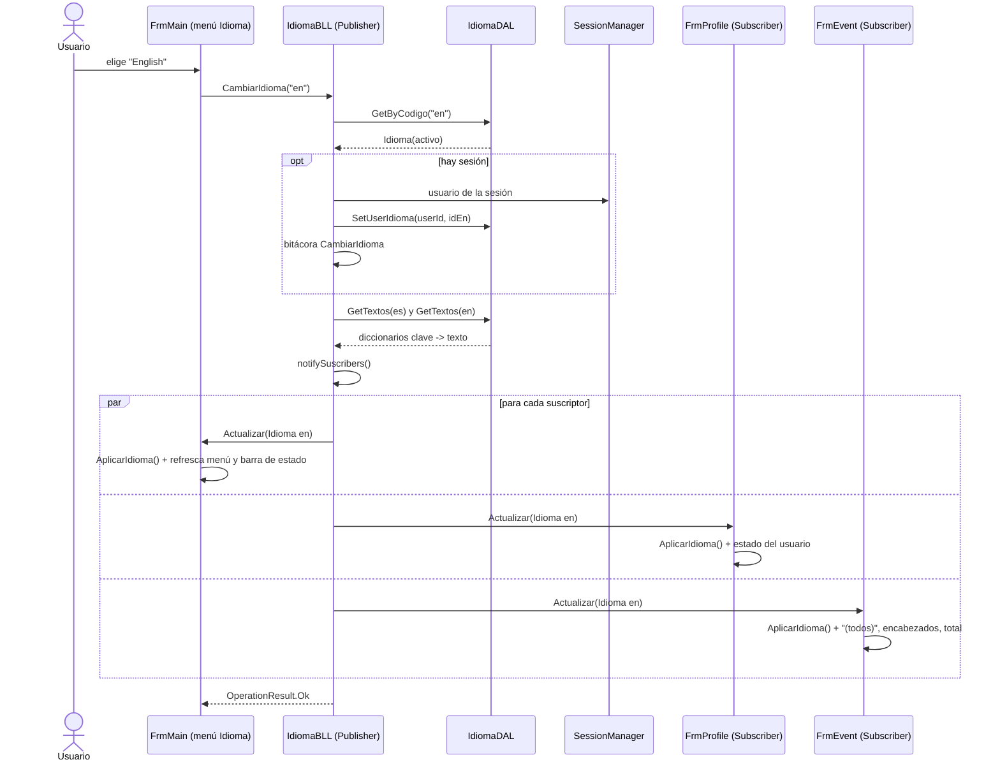
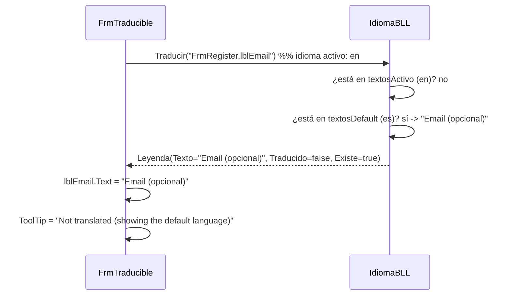
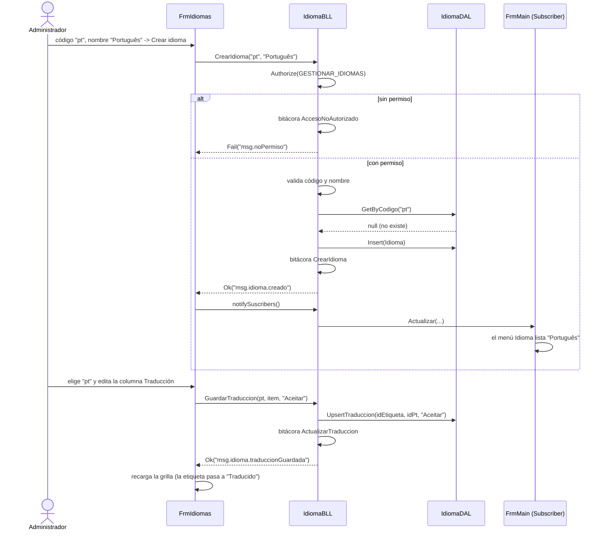

# DS - Gestión de idiomas con patrón Observer (T05)

## Objetivo

Mostrar cómo viaja un cambio de idioma desde el menú hasta cada formulario abierto, qué pasa con una leyenda sin
traducir y cómo el administrador incorpora un idioma nuevo. Ver clases en `DC-idiomas-observer.md`.

## Escenario 1 — Suscripción al abrir y desuscripción al cerrar

```mermaid
sequenceDiagram
    actor U as Usuario
    participant F as FrmTraducible (formulario hijo)
    participant B as IdiomaBLL (Publisher)
    participant D as IdiomaDAL

    U->>F: abre el formulario
    F->>B: suscribe(this)
    Note over B: lanza Exception si ya estaba suscripto
    F->>F: AplicarIdioma()
    loop cada control / ítem de menú con Name
        F->>B: Traducir("<Form>.<Name>")
        B-->>F: Leyenda(Texto, Traducido, Existe)
        alt Existe
            F->>F: control.Text = Texto (+ tooltip si !Traducido)
        end
    end
    F->>F: OnIdiomaAplicado() (textos armados por código)
    U->>F: cierra el formulario
    F->>B: unsuscribe(this)
```



## Escenario 2 — Cambio dinámico de idioma



## Escenario 3 — Leyenda sin traducir (fallback al idioma por defecto)



## Escenario 4 — Incorporar un idioma nuevo (administrador)



## Algoritmo de resolución (`IdiomaBLL.Traducir`)

```
Traducir(clave, args):
    si textosActivo contiene clave:
        texto = textosActivo[clave]; traducido = true;  existe = true
    sino si textosDefault contiene clave:
        texto = textosDefault[clave]; traducido = (activo es el default); existe = true
    sino:
        texto = clave; traducido = false; existe = false
    si hay args: texto = Format(texto, args)   (si el formato es inválido, queda el texto sin formatear)
    devolver Leyenda(clave, texto, traducido, existe)
```
