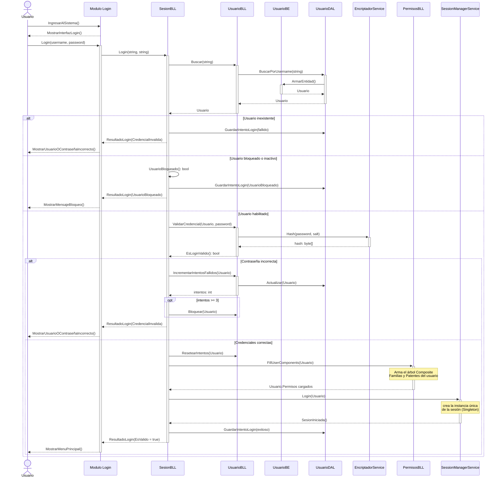

# DS - Login

Ingreso al sistema: validación de credenciales, política de bloqueo, carga del
árbol de permisos (Composite) y apertura de la sesión única (Singleton).

## Detalle

| Paso | Regla |
|---|---|
| Búsqueda del usuario | Se busca por `username`; el `password` nunca viaja a la DAL en claro |
| Validación | `EncriptadorService` calcula el hash con el `salt` del usuario y lo compara |
| Intentos fallidos | Se incrementan y persisten; al llegar a 3 el usuario queda `bloqueado` |
| Mensaje al usuario | Es el mismo para "usuario inexistente" y "contraseña incorrecta" (no se le informa al atacante cuál de los dos falló) |
| Permisos | Se cargan **una sola vez** al iniciar sesión — ver [DS-permisos-composite.md](DS-permisos-composite.md) |
| Sesión | La abre `SessionManager`, instancia única — ver [DS-sesion-singleton.md](DS-sesion-singleton.md) |

## Diagramas relacionados

- Clases: [DC-login.md](../DC%20-%20Diagrama%20de%20clases/DC-login.md)
- Datos: [DER-login.md](../DER%20-%20Diagrama%20entidad%20relación/DER-login.md)
- Caso de uso: [CU-login.md](../CU%20-%20Casos%20de%20uso/CU-login.md)
