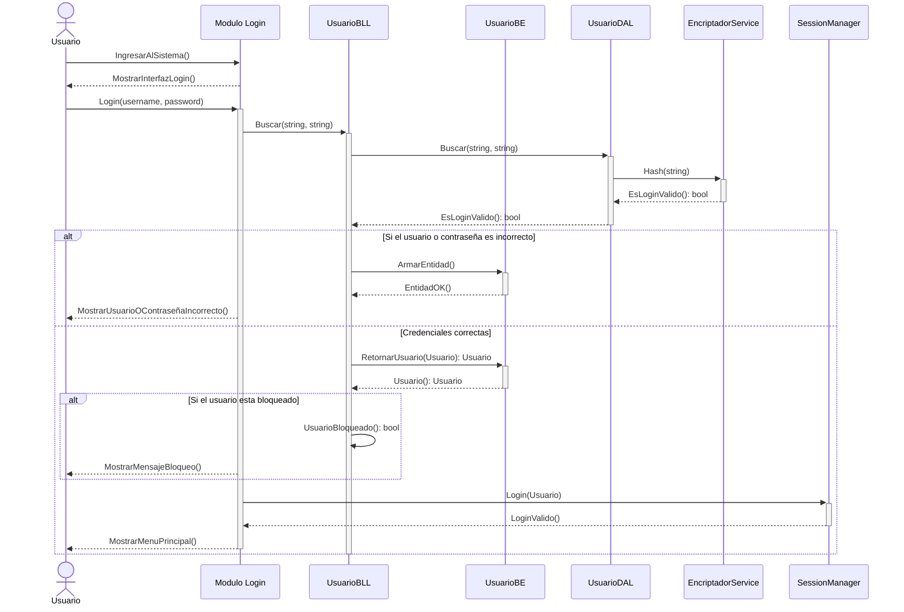

```mermaid

sequenceDiagram
    actor Usuario
    participant ML as Modulo Login
    participant BLL as UsuarioBLL
    participant BE as UsuarioBE
    participant DAL as UsuarioDAL
    participant Enc as EncriptadorService
    participant Sess as SessionManager

    Usuario->>ML: IngresarAlSistema()
    ML-->>Usuario: MostrarInterfazLogin()
    Usuario->>+ML: Login(username, password)
    ML->>+BLL: Buscar(string, string)
    BLL->>+DAL: Buscar(string, string)
    DAL->>+Enc: Hash(string)
    Enc-->>-DAL: EsLoginValido(): bool
    DAL-->>-BLL: EsLoginValido(): bool

    alt Si el usuario o contraseña es incorrecto
        BLL->>+BE: ArmarEntidad()
        BE-->>-BLL: EntidadOK()
        ML-->>Usuario: MostrarUsuarioOContraseñaIncorrecto()
    else Credenciales correctas
        BLL->>+BE: RetornarUsuario(Usuario): Usuario
        BE-->>-BLL: Usuario(): Usuario

        alt Si el usuario esta bloqueado
            BLL->>BLL: UsuarioBloqueado(): bool
            ML-->>Usuario: MostrarMensajeBloqueo()
        end
        %% else Usuario habilitado
            ML->>+Sess: Login(Usuario)
            Sess-->>-ML: LoginValido()
            ML-->>-Usuario: MostrarMenuPrincipal()
            
    end
    deactivate BLL
	
```