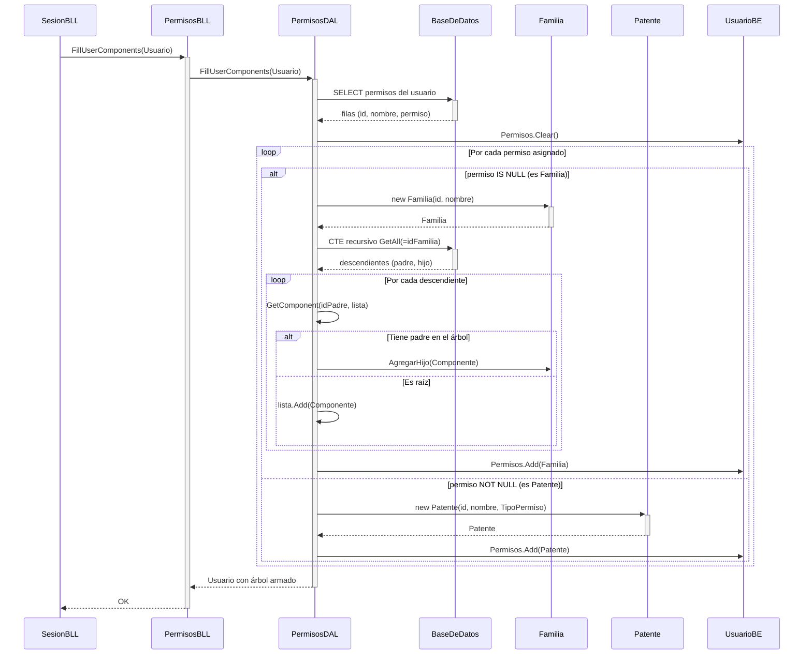
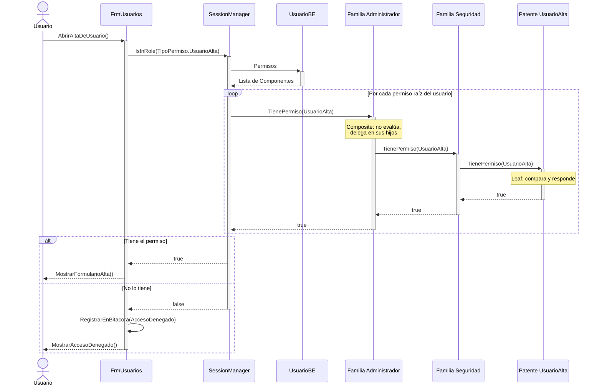

# DS - Permisos RBAC (Composite)

Dos escenarios sobre el mismo árbol de permisos:

1. **Carga** del árbol Familia/Patente desde la base al iniciar sesión.
2. **Verificación** de un permiso (`IsInRole`) mediante recorrido recursivo.

## 1. Carga del árbol de permisos del usuario

> El `SELECT` decide qué clase instanciar mirando **un solo campo**: si
> `permiso IS NULL` es `Familia` (Composite), si tiene valor es `Patente` (Leaf).

## 2. Verificación de un permiso (recorrido recursivo)

## Puntos clave

- **El cliente no pregunta el tipo**: `UI` y `SessionManager` sólo invocan
  `TienePermiso()`; el árbol se encarga de resolver. Sin Composite habría un
  `if (esFamilia) ... else ...` repetido en cada punto de control.
- **Corta en el primer `true`**: no recorre el árbol completo.
- **Profundidad N**: una familia puede contener otras familias sin límite; el
  algoritmo no cambia.
- **Ciclos**: si `PermisosBLL.GeneraCiclo()` no valida antes de guardar, este
  recorrido nunca termina. Es la única forma real de romper el patrón.

## Diagramas relacionados

- Clases: [DC-permisos-composite.md](../DC%20-%20Diagrama%20de%20clases/DC-permisos-composite.md)
- Datos: [DER-permisos-composite.md](../DER%20-%20Diagrama%20entidad%20relación/DER-permisos-composite.md)
