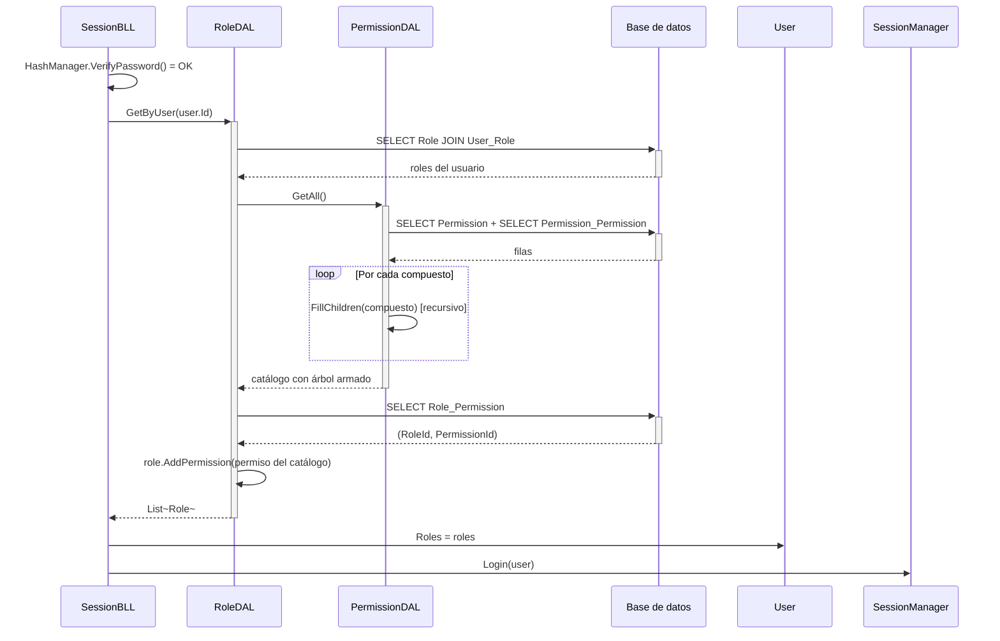
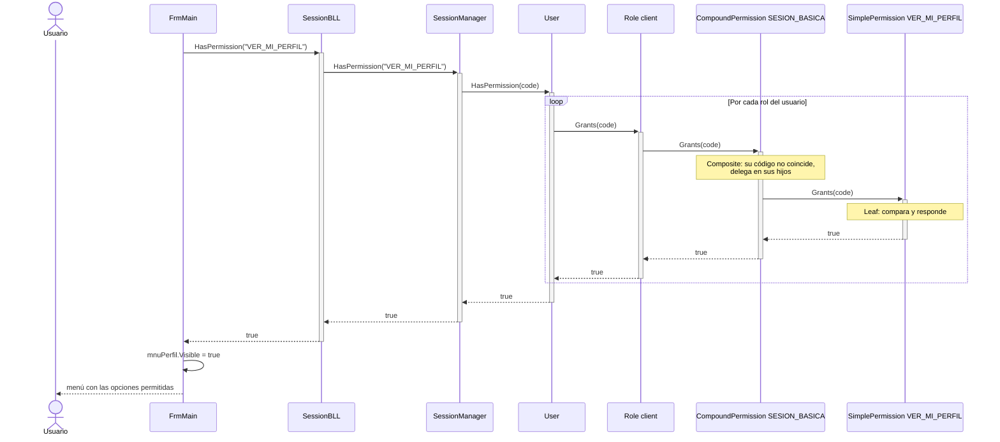
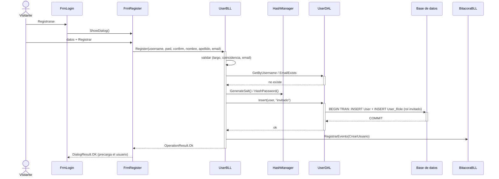
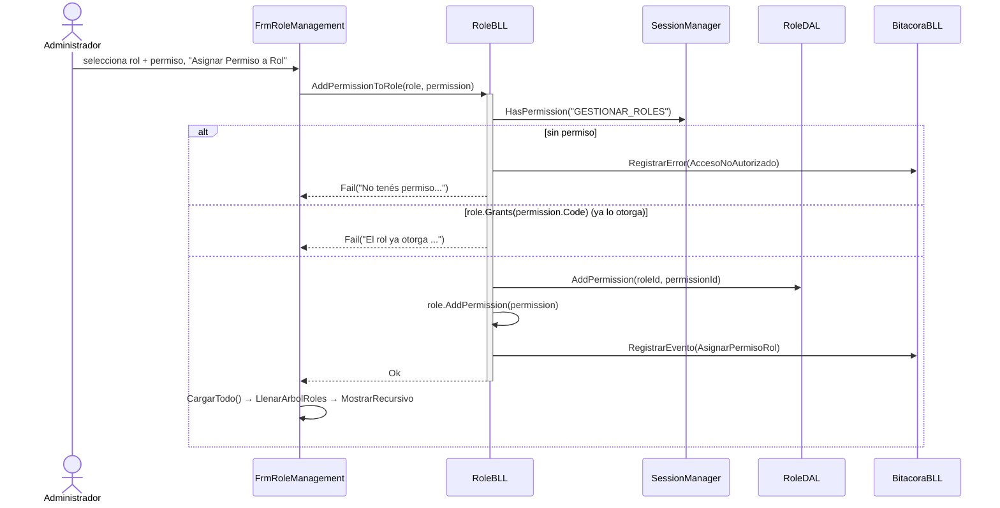

# DS - Perfiles de usuario (T04, Composite)

Cuatro escenarios sobre el mismo árbol de permisos:

1. **Carga** de roles y permisos al iniciar sesión.
2. **Verificación** de un permiso (`HasPermission`) por recorrido recursivo.
3. **Registro** de un usuario nuevo (rol `invitado`).
4. **Agregar un permiso a un rol** desde la gestión de roles.

## 1. Carga de roles y permisos al iniciar sesión

```mermaid
sequenceDiagram
    participant SBLL as SessionBLL
    participant RDAL as RoleDAL
    participant PDAL as PermissionDAL
    participant BD as Base de datos
    participant U as User
    participant SM as SessionManager

    SBLL->>SBLL: HashManager.VerifyPassword() = OK
    SBLL->>+RDAL: GetByUser(user.Id)
    RDAL->>+BD: SELECT Role JOIN User_Role
    BD-->>-RDAL: roles del usuario
    RDAL->>+PDAL: GetAll()
    PDAL->>+BD: SELECT Permission + SELECT Permission_Permission
    BD-->>-PDAL: filas
    loop Por cada compuesto
        PDAL->>PDAL: FillChildren(compuesto) [recursivo]
    end
    PDAL-->>-RDAL: catálogo con árbol armado
    RDAL->>+BD: SELECT Role_Permission
    BD-->>-RDAL: (RoleId, PermissionId)
    RDAL->>RDAL: role.AddPermission(permiso del catálogo)
    RDAL-->>-SBLL: List~Role~
    SBLL->>U: Roles = roles
    SBLL->>SM: Login(user)
```

> `PermissionMapper` decide qué clase instanciar mirando `IsCompound`: `0` →
> `SimplePermission` (Leaf), `1` → `CompoundPermission` (Composite).
> Los roles se cargan **antes** de abrir la sesión para que la bitácora del
> login ya registre los roles y permisos del usuario.

## 2. Verificación de un permiso (recorrido recursivo)

```mermaid
sequenceDiagram
    actor Usuario
    participant UI as FrmMain
    participant SBLL as SessionBLL
    participant SM as SessionManager
    participant U as User
    participant R as Role client
    participant C as CompoundPermission SESION_BASICA
    participant L as SimplePermission VER_MI_PERFIL

    UI->>+SBLL: HasPermission("VER_MI_PERFIL")
    SBLL->>+SM: HasPermission("VER_MI_PERFIL")
    SM->>+U: HasPermission(code)
    loop Por cada rol del usuario
        U->>+R: Grants(code)
        R->>+C: Grants(code)
        Note over C: Composite: su código no coincide,<br/>delega en sus hijos
        C->>+L: Grants(code)
        Note over L: Leaf: compara y responde
        L-->>-C: true
        C-->>-R: true
        R-->>-U: true
    end
    U-->>-SM: true
    SM-->>-SBLL: true
    SBLL-->>-UI: true
    UI->>UI: mnuPerfil.Visible = true
    UI-->>Usuario: menú con las opciones permitidas
```

## 3. Registro de un usuario nuevo

```mermaid
sequenceDiagram
    actor Visitante
    participant L as FrmLogin
    participant R as FrmRegister
    participant UB as UserBLL
    participant H as HashManager
    participant UD as UserDAL
    participant BD as Base de datos
    participant B as BitacoraBLL

    Visitante->>L: Registrarse
    L->>R: ShowDialog()
    Visitante->>R: datos + Registrar
    R->>+UB: Register(username, pwd, confirm, nombre, apellido, email)
    UB->>UB: validar (largo, coincidencia, email)
    UB->>+UD: GetByUsername / EmailExists
    UD-->>-UB: no existe
    UB->>H: GenerateSalt() / HashPassword()
    UB->>+UD: Insert(user, "invitado")
    UD->>+BD: BEGIN TRAN: INSERT User + INSERT User_Role (rol invitado)
    BD-->>-UD: COMMIT
    UD-->>-UB: ok
    UB->>B: RegistrarEvento(CrearUsuario)
    UB-->>-R: OperationResult.Ok
    R-->>L: DialogResult.OK (precarga el usuario)
```

> Si el rol `invitado` no existe, el `INSERT` a `User_Role` afecta 0 filas, se
> lanza un error y la transacción hace *rollback*: nunca queda un usuario sin rol.

## 4. Agregar un permiso a un rol

```mermaid
sequenceDiagram
    actor Admin as Administrador
    participant F as FrmRoleManagement
    participant RB as RoleBLL
    participant SM as SessionManager
    participant RD as RoleDAL
    participant B as BitacoraBLL

    Admin->>F: selecciona rol + permiso, "Asignar Permiso a Rol"
    F->>+RB: AddPermissionToRole(role, permission)
    RB->>SM: HasPermission("GESTIONAR_ROLES")
    alt sin permiso
        RB->>B: RegistrarError(AccesoNoAutorizado)
        RB-->>F: Fail("No tenés permiso...")
    else role.Grants(permission.Code) (ya lo otorga)
        RB-->>F: Fail("El rol ya otorga ...")
    else
        RB->>RD: AddPermission(roleId, permissionId)
        RB->>RB: role.AddPermission(permission)
        RB->>B: RegistrarEvento(AsignarPermisoRol)
        RB-->>-F: Ok
        F->>F: CargarTodo() → LlenarArbolRoles → MostrarRecursivo
    end
```

## Puntos clave

- **El cliente no pregunta el tipo**: `FrmMain`, `RoleBLL` y `SessionManager` sólo
  invocan `Grants` / `HasPermission`; el árbol resuelve solo. Sin Composite habría un
  `if (esCompuesto) ... else ...` repetido en cada punto de control.
- **Corta en el primer `true`**: no recorre el árbol completo.
- **Profundidad N**: un compuesto puede contener otros compuestos; el algoritmo no cambia.
- **Ciclos**: `CompoundPermission.Add` los rechaza; sin esa validación el recorrido
  recursivo no terminaría.
- **Seguridad en profundidad**: la UI oculta opciones, pero la BLL vuelve a validar
  el permiso en cada operación y audita el intento denegado.

## Diagramas relacionados

- Clases: [DC-permisos-composite.md](../DC%20-%20Diagrama%20de%20clases/DC-permisos-composite.md)
- Datos: [DER-permisos-composite.md](../DER%20-%20Diagrama%20entidad%20relación/DER-permisos-composite.md)
- Casos de uso: [CU-gestion-perfiles.md](../CU%20-%20Casos%20de%20uso/CU-gestion-perfiles.md)
