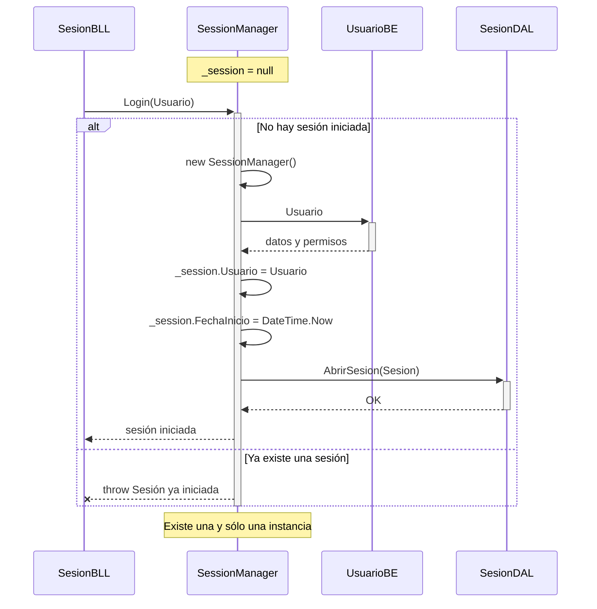
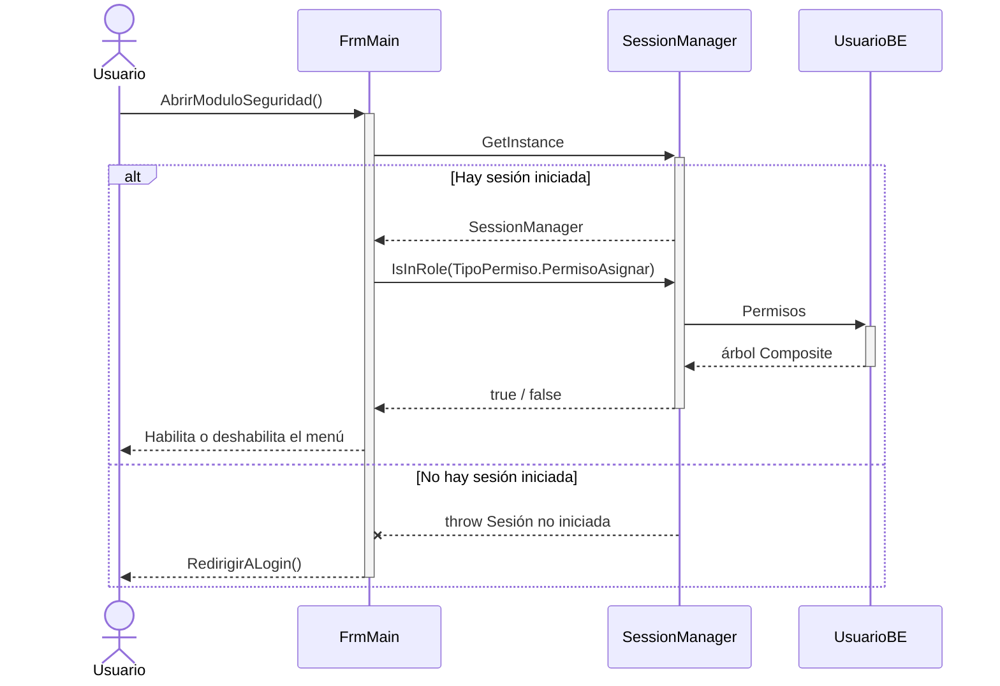
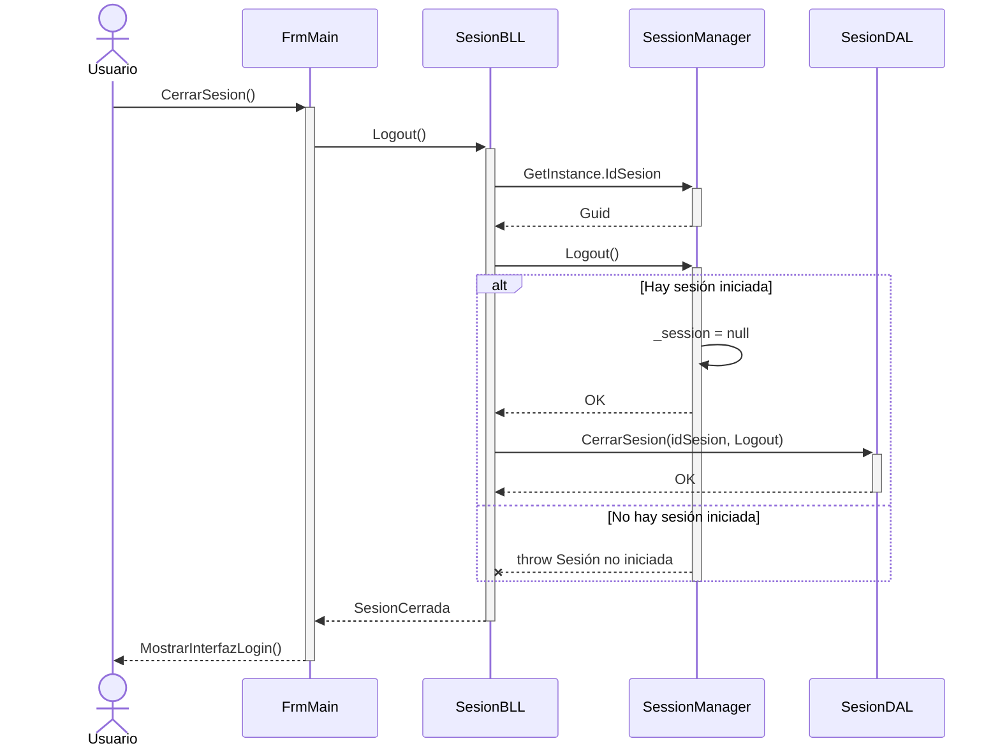

# DS - Sesión (Singleton)

Ciclo de vida de la instancia única de `SessionManager`: creación, uso durante la
aplicación y destrucción.

## 1. Instanciación de la sesión

## 2. Uso de la sesión durante la aplicación

## 3. Cierre de sesión

## Puntos clave

| Situación | Comportamiento |
|---|---|
| `Login` sin sesión previa | Crea la instancia con el usuario y la fecha de inicio |
| `Login` con sesión ya iniciada | Lanza excepción: no se permite una segunda sesión |
| `GetInstance` sin sesión | Lanza excepción: el sistema redirige al log-in |
| `Logout` con sesión activa | Destruye la instancia y cierra la sesión en la base |
| `Logout` sin sesión | Lanza excepción |
| Cierre abrupto de la aplicación | La sesión queda abierta en la base y se depura en el próximo arranque |

## Diagramas relacionados

- Clases: [DC-sesion-singleton.md](../DC%20-%20Diagrama%20de%20clases/DC-sesion-singleton.md)
- Datos: [DER-sesion.md](../DER%20-%20Diagrama%20entidad%20relación/DER-sesion.md)
- Login: [DS-login.md](DS-login.md)
