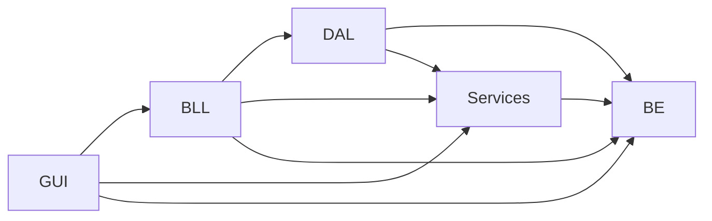
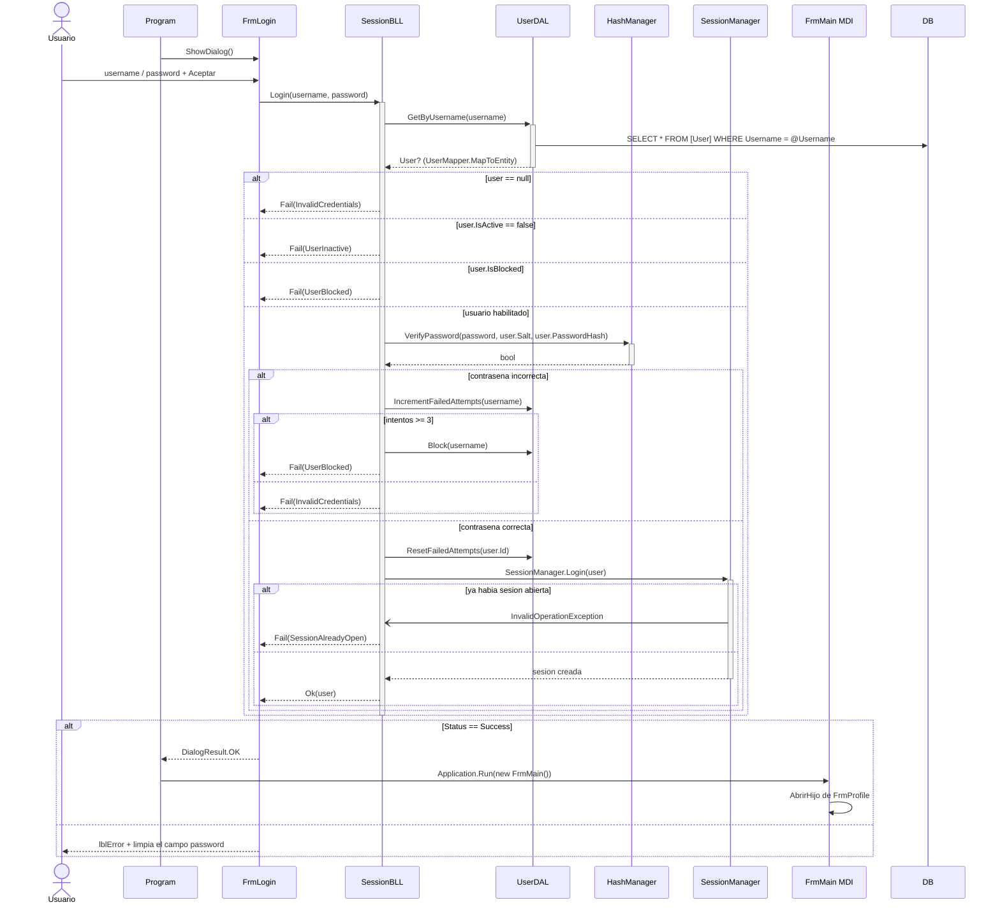
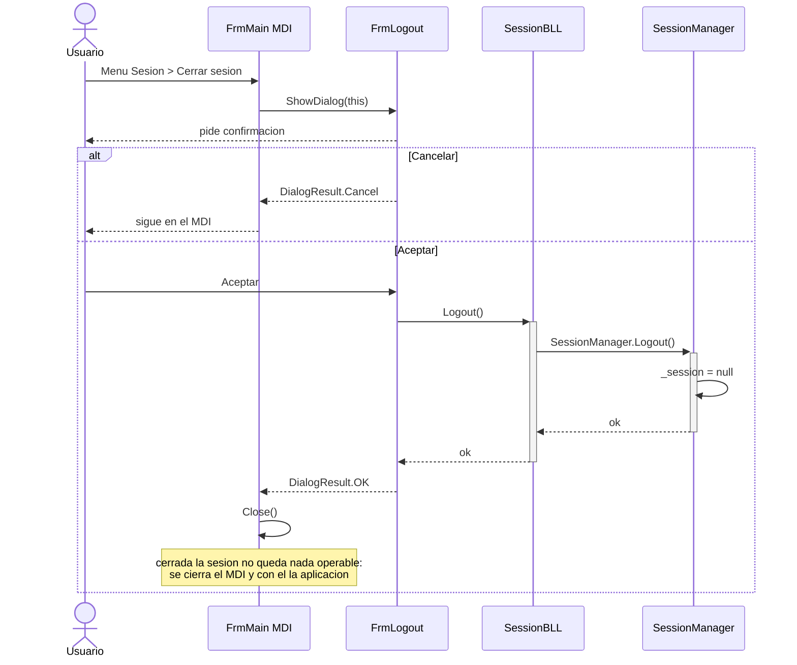
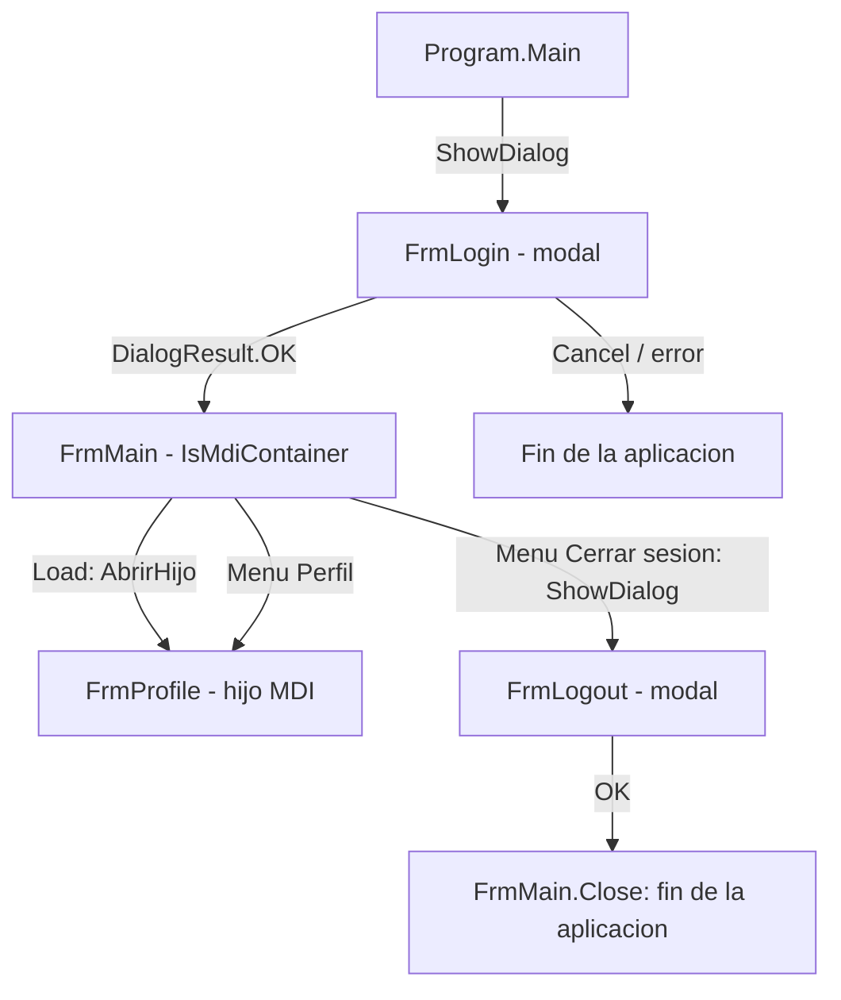

# ingSoftWinForm

Aplicación WinForms (.NET 8) del CU-01 *Iniciar sesión*, organizada en capas.
Este documento explica **la base de datos**, **cómo se crean los usuarios**, los
**diagramas de secuencia de login y logout**, cómo funciona el **SessionManager**,
cómo funciona el esquema de **formularios MDI** y cómo funciona la **bitácora
de auditoría**.

---

## 1. Arquitectura en capas

```
01 - Presentation Layer/UI      →  GUI.csproj        (net8.0-windows)  FrmLogin, FrmMain, FrmLogout, FrmProfile, FrmEvent
02 - Service Layer/Services     →  Services.csproj   (net8.0)          HashManager, SessionManager, BitacoraManager
03 - Business Logic Layer/BLL   →  BLL.csproj        (net8.0)          SessionBLL, BitacoraBLL
04 - Business Entity/BE         →  BE.csproj         (net8.0)          User, Bitacora, LoginResult, enums, mappers, bases
05 - Data Access Layer/DAL      →  DAL.csproj        (net8.0)          DatabaseHelper, IUserDAL/UserDAL, IBitacoraDAL/BitacoraDAL
```

Dependencias entre proyectos (`ProjectReference`):



La UI **nunca** referencia a DAL: todo pasa por `SessionBLL`. Y la UI tampoco llama
al `SessionManager` directamente — usa `SessionBLL.CurrentUser` / `SessionBLL.Logout()`.

Paquetes NuGet: `Microsoft.Data.SqlClient` y `System.Configuration.ConfigurationManager`,
ambos solo en DAL.

---

## 2. Base de datos

### Motor y conexión

- **Motor:** SQL Server (probado sobre `localhost\SQLEXPRESS`).
- **Base:** `IF_DB`.
- **Cadena de conexión:** `01 - Presentation Layer/UI/App.config`, con el nombre `IF_DB`:

```xml
<add name="IF_DB"
     connectionString="Server=localhost\SQLEXPRESS;Database=IF_DB;Integrated Security=True;TrustServerCertificate=True;"
     providerName="Microsoft.Data.SqlClient" />
```

`DAL.DatabaseHelper` es el **único punto del sistema que abre conexiones**. Lee esa
entrada con `ConfigurationManager` y lanza `ConfigurationErrorsException` si no existe.
Expone solo dos métodos: `ExecuteDataSet(...)` y `ExecuteNonQuery(...)`, ambos con
`SqlParameter[]` (nunca concatenación de strings → sin SQL injection).

### Tabla `[dbo].[User]`

Script: `../sql/01_create_table_User.sql`.

| Columna | Tipo | Notas |
|---|---|---|
| `Id` | `UNIQUEIDENTIFIER` | PK clustered, default `NEWID()` |
| `Username` | `NVARCHAR(50)` | `UNIQUE` (`UQ_User_Username`) |
| `PasswordHash` | `VARBINARY(32)` | PBKDF2-SHA256, 32 bytes |
| `Salt` | `VARBINARY(16)` | salt aleatorio por usuario |
| `FirstName` / `LastName` | `NVARCHAR(100)` | |
| `Email` | `NVARCHAR(150)` NULL | único entre los no-NULL (índice filtrado `UX_User_Email`) |
| `FailedAttempts` | `INT` | default 0 |
| `IsBlocked` | `BIT` | default 0 |
| `IsActive` | `BIT` | default 1 |
| `LastLoginAt` | `DATETIME2` NULL | |
| `CreatedAt` / `CreatedBy` / `UpdatedAt` / `UpdatedBy` | | auditoría, refleja `BE.Base.BaseAuditEntity` |

Dos detalles que hacen ruido si no se conocen:

- `[User]` es palabra reservada en T-SQL → **siempre entre corchetes**.
- `UX_User_Email` es un **índice filtrado**, así que todo `INSERT`/`UPDATE` sobre la
  tabla exige `QUOTED_IDENTIFIER ON`. Desde la app y desde SSMS ya viene en ON; desde
  `sqlcmd` hay que pasar el flag `-I` o falla con el error 1934.

### Consultas que ejecuta la app

Todas en `05 - Data Access Layer/DAL/UserDAL.cs`, texto plano parametrizado (no hay
stored procedures):

| Método | SQL |
|---|---|
| `GetByUsername(username)` | `SELECT * FROM [User] WHERE Username = @Username` |
| `GetAll()` | `SELECT * FROM [User]` |
| `Block(username)` | `UPDATE [User] SET IsBlocked = 1, UpdatedAt = SYSDATETIME() ...` |
| `IncrementFailedAttempts(username)` | `UPDATE [User] SET FailedAttempts = FailedAttempts + 1 ...` |
| `ResetFailedAttempts(id)` | `UPDATE [User] SET FailedAttempts = 0, LastLoginAt = SYSDATETIME() ...` |

Notar que **la contraseña nunca viaja al SQL**: se busca solo por `Username` y la
verificación del hash la hace la BLL en memoria con `HashManager`.

### Puesta en marcha

Crear la base:

```bash
sqlcmd -S localhost\SQLEXPRESS -E -C -Q "IF DB_ID('IF_DB') IS NULL CREATE DATABASE [IF_DB];"
```

Crear la tabla:

```bash
sqlcmd -S localhost\SQLEXPRESS -E -C -I -d IF_DB -i sql/01_create_table_User.sql
```

> `01_create_table_User.sql` empieza con un `DROP TABLE` condicional: volver a correrlo
> borra todos los usuarios cargados.

Crear la tabla de bitácora:

```bash
sqlcmd -S localhost\SQLEXPRESS -E -C -I -d IF_DB -i sql/03_create_table_Bitacora.sql
```

> Este, al revés, **no** dropea nada (`IF OBJECT_ID(...) IS NULL`): reejecutarlo no
> puede borrar el historial de auditoría.

---

## 3. Cómo se crean los usuarios

**No se pueden sembrar desde un `.sql` suelto.** La contraseña se guarda como
PBKDF2-SHA256 con 100.000 iteraciones (`Services.HashManager`) y T-SQL no tiene PBKDF2
— `HASHBYTES` hace un SHA2_256 de una sola pasada, que no es lo mismo. Un hash escrito
a mano hace que `HashManager.VerifyPassword` devuelva siempre `false` y el login no
entre nunca.

Por eso existe `../sql/create-user.sh`, que calcula el mismo par salt/hash (vía
`python`) y hace el `INSERT`:

```bash
./sql/create-user.sh -u admin -p Admin123 -f Admin -l "Del Sistema" -e admin@if.local
```

Opciones:

| Flag | Significado | Default |
|---|---|---|
| `-u` | username (obligatorio, único) | — |
| `-p` | contraseña en claro (obligatorio) | — |
| `-f` | FirstName | `Nombre` |
| `-l` | LastName | `Apellido` |
| `-e` | Email | `NULL` |
| `-S` | instancia SQL | `localhost\SQLEXPRESS` |
| `-d` | base de datos | `IF_DB` |
| `-h` | ayuda | — |

Requisitos: `python` y `sqlcmd` en el PATH. La contraseña se pasa al intérprete por
variable de entorno y no por argumento, porque los argumentos de un proceso son
visibles para cualquier otro proceso de la máquina. El script corta con `RAISERROR` si
el username ya existe, y al terminar lista los usuarios cargados.

Para ver qué hay en la tabla sin crear nada:

```bash
sqlcmd -S localhost\SQLEXPRESS -E -C -I -d IF_DB -i sql/02_seed_User.sql
```

`02_seed_User.sql` **no crea usuarios**: solo hace un `SELECT` y documenta el
procedimiento manual, con el `INSERT` comentado y el snippet de Python para generar el
par salt/hash a mano.

### Cómo se guarda la contraseña — `Services.HashManager`

| Parámetro | Valor |
|---|---|
| Algoritmo | PBKDF2 (`Rfc2898DeriveBytes.Pbkdf2`) |
| Hash interno | SHA256 |
| Iteraciones | 100.000 |
| Salt | 16 bytes aleatorios por usuario |
| Hash | 32 bytes |

`VerifyPassword` compara con `CryptographicOperations.FixedTimeEquals`: no corta en el
primer byte distinto, así el tiempo de respuesta no filtra información del hash
(RNF-Seguridad-01). La contraseña en claro nunca sale de esta clase.

---

## 4. Login

### Reglas de negocio (`03 - Business Logic Layer/BLL/SessionBLL.cs`)

1. Usuario inexistente y contraseña incorrecta devuelven **el mismo**
   `InvalidCredentials`: el mensaje no debe revelar si el usuario existe
   (CU-01, FA-1 paso 4c).
2. `IsActive = 0` → `UserInactive`. `IsBlocked = 1` → `UserBlocked`.
3. **Bloqueo automático a los 3 intentos fallidos** (`MaxFailedAttempts = 3`,
   RNF-Seguridad-02).
4. Login correcto → resetea `FailedAttempts` y sella `LastLoginAt`.
5. Si ya había una sesión abierta → `SessionAlreadyOpen`, no se abre una segunda (FA-4).

El resultado se devuelve como `LoginResult` y no con excepciones: una credencial mal
tipeada es un caso de negocio esperable, no excepcional. `LoginStatus` = `Success`,
`InvalidCredentials`, `UserBlocked`, `UserInactive`, `SessionAlreadyOpen`.

### Diagrama de secuencia — Login



Si la base no responde, `FrmLogin` captura la excepción y muestra *"No se pudo conectar
con el servidor. Intente nuevamente."* (FA-5), con el detalle en `Debug.WriteLine`.

> Nota: el `User` que queda en sesión es el snapshot leído **antes** del
> `ResetFailedAttempts`, así que el `LastLoginAt` que muestra el perfil es el del acceso
> anterior, no el de la sesión en curso. Es lo que normalmente se espera de un "último
> acceso", pero conviene saberlo.

---

## 5. Logout

Cerrar sesión no toca la base: solo descarta el singleton en memoria y cierra el MDI.



`FrmLogout` no llama al `SessionManager`: pasa por `SessionBLL.Logout()`, que respeta el
corte de capas.

---

## 6. SessionManager (Singleton)

`02 - Service Layer/Services/SessionManager.cs`. Existe **una y sólo una** sesión activa
mientras la aplicación está en ejecución (ver `DC-sesion-singleton.md` en `docs/`).

```csharp
private static SessionManager? _session;   // el estado vive en un campo static
private SessionManager() { }               // constructor privado: nadie la instancia desde afuera

public User User { get; private set; }     // usuario logueado, solo lectura desde afuera
public DateTime StartedAt { get; private set; }
```

| Miembro | Qué hace |
|---|---|
| `SessionManager.Login(user)` | Crea la instancia con `User` y `StartedAt = DateTime.Now`. Lanza `InvalidOperationException` si **ya** hay sesión. |
| `SessionManager.Logout()` | Pone `_session = null`. Lanza `InvalidOperationException` si **no** hay sesión. |
| `SessionManager.IsLoggedIn()` | `_session != null`. Es el único chequeo que siempre es seguro llamar. |
| `SessionManager.GetInstance` | Devuelve la instancia. Lanza `InvalidOperationException` si no hay sesión. |

Es un singleton **con ciclo de vida**, no el clásico "instancia perezosa eterna": se
crea en el login y se destruye en el logout. Por eso `GetInstance` puede tirar excepción
y hay que preguntar `IsLoggedIn()` antes.

**Cómo lo consume el resto del sistema:**

- La UI **no** lo toca directamente. Pasa por `SessionBLL`:
  - `sessionBLL.CurrentUser` → `IsLoggedIn() ? GetInstance.User : null` (devuelve `null`
    en vez de romper).
  - `sessionBLL.IsLoggedIn`
  - `sessionBLL.Logout()`
- `SessionBLL.Login` envuelve `SessionManager.Login` en un try/catch y traduce la
  excepción a `LoginStatus.SessionAlreadyOpen` (FA-4).

Consecuencias a tener presentes:

- Cada `Form` crea su propio `new SessionBLL()`, pero todos ven la **misma** sesión: el
  estado es `static`, no de instancia.
- El `User` guardado es un snapshot del momento del login; si cambian los datos en la
  base, la sesión no se entera hasta el próximo login.
- No hay sincronización de hilos ni `Lazy<T>`. Alcanza para WinForms, donde todo corre
  en el hilo de UI.

---

## 7. Bitácora de auditoría

**RNF-Seguridad-03 del CU-01: todo intento de acceso queda auditado.** La bitácora es
una tabla append-only: se inserta y no se modifica nunca.

### Tabla `[dbo].[Bitacora]`

Script: `../sql/03_create_table_Bitacora.sql`. Refleja `BE.Entity.Bitacora`.

| Columna | Tipo | Notas |
|---|---|---|
| `id_bitacora` | `INT IDENTITY` | PK clustered. **Único nombre del modelo que no está en inglés**, por pedido del diagrama de clases |
| `Type` | `NVARCHAR(20)` | enum `BitacoraType`: `Event` / `Error` |
| `NameEvent` | `NVARCHAR(30)` | enum `NameEvent`: `Login`, `Logout`, `CrearUsuario`, ... |
| `Priority` | `NVARCHAR(20)` | enum `Priority`: `Low` / `Medium` / `High` / `Critical` / `Fatal` |
| `Detail` | `NVARCHAR(500)` | texto libre; `BitacoraManager` lo recorta a 500 |
| `BitacoraDate` | `DATETIME2` | default `SYSDATETIME()` |
| `IdUser` / `Email` / `FirstName` / `LastName` | `NVARCHAR` | foto del usuario, todos `string` |
| `RolesPermisos` | `NVARCHAR(MAX)` | roles y permisos que tenía en ese momento |

Tres decisiones que conviene tener presentes:

- **Los enums se guardan por nombre, no por ordinal.** Una bitácora se consulta con un
  `SELECT` suelto: `'Critical'` se lee, `4` no.
- **No hay FK contra `[User]`.** Los datos del usuario se *copian*, no se referencian: la
  traza tiene que sobrevivir a una baja o un renombre, y además hay filas sin usuario
  (un login con un username que no existe).
- **`RolesPermisos` queda vacío por ahora.** El árbol Composite de permisos todavía no
  está implementado; el campo y el punto de llenado
  (`BitacoraManager.AplanarRolesPermisos`) ya están listos.

### Quién hace qué

```
Services.BitacoraManager   construye la entidad (EventoBitacora / ErrorBitacora)
BLL.BitacoraBLL            la persiste, y consulta (GetAll / GetByFilter)
DAL.BitacoraDAL            el INSERT y los SELECT
UI.Event.FrmEvent          el visor de solo lectura
```

Ojo con el nombre del visor: **sólo la capa de UI habla de `Event`**
(`UI.Event.FrmEvent`). La entidad, la BLL, la DAL y la tabla se siguen llamando
`Bitacora`. Y como el namespace `UI.Event` tapa al tipo `BE.Entity.Bitacora`,
`FrmEvent.cs` lo nombra por un alias (`using BitacoraEntity = BE.Entity.Bitacora;`).

`BitacoraManager` es la pieza `Servicios.Bitacora` del diagrama de clases. Solo
**construye** la entidad y no la persiste, porque la capa de servicios no referencia a
DAL. Se llama `BitacoraManager` y no `Bitacora` para no chocar con `BE.Entity.Bitacora`,
y para acompañar a `SessionManager` y `HashManager`.

Cada fábrica tiene dos sobrecargas:

- con `User` explícito — la que usa el login, porque en un intento fallido **todavía no
  hay sesión abierta** y `SessionManager.GetInstance` tiraría excepción;
- sin `User` — toma el de la sesión activa, y si no hay ninguna deja los campos vacíos.

### La auditoría nunca voltea la operación auditada

`BitacoraBLL.Registrar` atrapa la excepción y la manda a `Debug.WriteLine`. Si se cae la
base, el login tiene que poder seguir devolviendo su `LoginResult` (CU-01, FA-5): un
fallo al auditar no puede convertirse en un crash.

El visor va al revés: ahí el error **sí** se avisa con un `MessageBox`, porque si no se
puede leer no hay nada que mostrar en pantalla.

### Qué registra el login

Todo esto sale de `SessionBLL` (`03 - Business Logic Layer/BLL/SessionBLL.cs`):

| Situación | Type | NameEvent | Priority |
|---|---|---|---|
| Username inexistente | `Error` | `Login` | `Medium` |
| Usuario dado de baja | `Error` | `Login` | `Medium` |
| Usuario bloqueado | `Error` | `Login` | `High` |
| Credencial inválida | `Error` | `Login` | `Medium` |
| Bloqueo automático al 3º intento | `Error` | `Login` | `Critical` |
| FA-4: ya había una sesión abierta | `Error` | `Login` | `High` |
| Inicio de sesión exitoso | `Event` | `Login` | `Low` |
| Cierre de sesión | `Event` | `Logout` | `Low` |

Dos cuidados en el código:

- en `Logout()` el usuario se toma **antes** de `SessionManager.Logout()`, que borra la sesión;
- el caso "username inexistente" no tiene `User`: el username tipeado va en el `Detail`.
  **La contraseña no se registra nunca.**

### Verla — `UI.Event.FrmEvent`

Menú *Sesión ▸ Bitácora*. Grilla de sólo lectura con cuatro filtros:

| Filtro | Control | Vacío significa |
|---|---|---|
| Rango de fechas | `dtpDesde` / `dtpHasta` | siempre se aplica; el “hasta” es inclusivo por día |
| Tipo | `cboTipo` | `(todos)` → no filtra |
| Evento | `cboEvento` | `(todos)` → no filtra |
| Prioridad | `cboPrioridad` | `(todos)` → no filtra |

Los tres combos se llenan con `System.Enum.GetValues<TEnum>()`, y guardan los valores
del enum **en crudo** — no su texto — así que se recuperan tipados sin volver a parsear.

El filtrado se resuelve en el motor, no en memoria: la bitácora crece sin techo y
traerla entera para descartar en el cliente no escala. `BitacoraDAL.GetByFilter` usa el
patrón `(@P IS NULL OR col = @P)` para cada enum opcional, que evita armar el `WHERE`
concatenando texto:

```sql
WHERE [BitacoraDate] >= @From
  AND [BitacoraDate] <  @To
  AND (@Type      IS NULL OR [Type]      = @Type)
  AND (@NameEvent IS NULL OR [NameEvent] = @NameEvent)
  AND (@Priority  IS NULL OR [Priority]  = @Priority)
```

También se puede consultar directo por SQL:

```bash
sqlcmd -S localhost\SQLEXPRESS -E -C -I -W -d IF_DB -Q "SET NOCOUNT ON; SELECT id_bitacora, Type, NameEvent, Priority, BitacoraDate, FirstName, LastName, Detail FROM [dbo].[Bitacora] ORDER BY id_bitacora DESC;"
```

---

## 8. Formularios MDI

### Quién es contenedor y quién no

| Formulario | Rol |
|---|---|
| `FrmLogin` | Diálogo **modal**, antes del MDI. Lo abre `Program.Main` con `ShowDialog()`. |
| `FrmMain` | **Contenedor MDI** (`IsMdiContainer = true`). Es el `Application.Run(...)`. |
| `FrmProfile` | **Ventana hija** MDI. |
| `FrmLogout` | Diálogo **modal** sobre el MDI (`ShowDialog(this)`), no es hijo. |

Login y logout son modales a propósito: un formulario modal no puede ser hijo MDI, y
además son decisiones que deben bloquear al resto de la aplicación.

### Arranque

```csharp
// Program.cs — CU-01: sin sesión iniciada no se entra al menú principal.
using var login = new FrmLogin();
if (login.ShowDialog() != DialogResult.OK) return;
Application.Run(new FrmMain());
```

Si el login se cancela o falla, `Main` retorna y la aplicación **nunca** llega a crear
el MDI.

### Apertura de hijos: `AbrirHijo<TForm>()`

```csharp
public void AbrirHijo<TForm>() where TForm : Form, new()
{
    var abierto = MdiChildren.OfType<TForm>().FirstOrDefault();
    if (abierto != null)
    {
        if (abierto.WindowState == FormWindowState.Minimized)
            abierto.WindowState = FormWindowState.Normal;
        abierto.Activate();
        return;
    }
    var frm = new TForm { MdiParent = this };
    frm.Show();
}
```

Es genérico y con restricción `new()`, así que agregar una pantalla nueva es
`AbrirHijo<FrmLoQueSea>()` desde el menú, sin escribir código de manejo de ventanas.
La regla es **una instancia por tipo**: si ya está abierta se restaura (por si estaba
minimizada) y se activa, en vez de duplicarla.

`FrmProfile` se abre en `FrmMain_Load` y **no** en el constructor: en el constructor el
contenedor MDI todavía no tiene el handle creado y asignar `MdiParent` falla. Es la
primera pantalla que ve el usuario al entrar.

### Menú

`menuStrip.MdiWindowListItem = mnuVentana` → WinForms mantiene solo la lista de ventanas
abiertas dentro del menú *Ventana*, con la marca sobre la activa.

| Menú | Acción |
|---|---|
| Sesión ▸ Mi perfil | `AbrirHijo<FrmProfile>()` |
| Sesión ▸ Bitácora | `AbrirHijo<FrmBitacora>()` |
| Sesión ▸ Cerrar sesión | `FrmLogout` modal; si acepta → `Close()` del MDI |
| Sesión ▸ Salir | `Close()` |
| Ventana ▸ Cascada | `LayoutMdi(MdiLayout.Cascade)` |
| Ventana ▸ Mosaico horizontal | `LayoutMdi(MdiLayout.TileHorizontal)` |
| Ventana ▸ Mosaico vertical | `LayoutMdi(MdiLayout.TileVertical)` |
| Ventana ▸ Cerrar todas | recorre `MdiChildren.ToList()` y cierra cada hijo |

En *Cerrar todas* se copia la colección con `.ToList()` a propósito: cerrar un hijo
modifica `MdiChildren` mientras se la está recorriendo.

`FrmMain` muestra el usuario en sesión en `lblUsuario`, tomado de
`sessionBLL.CurrentUser` en el constructor; si no hay sesión dice "Sin sesión".

### Flujo de ventanas



---

## 9. Correr el proyecto

```bash
dotnet build ingSoftWinForm/ingSoftWinForm.sln
```

Proyecto de inicio: `GUI` (`01 - Presentation Layer/UI/GUI.csproj`). Antes del primer
arranque hay que tener la base `IF_DB` creada, las tablas `[User]` y `[Bitacora]`, y al
menos un usuario hecho con `create-user.sh` — si no, no hay forma de pasar el login.
